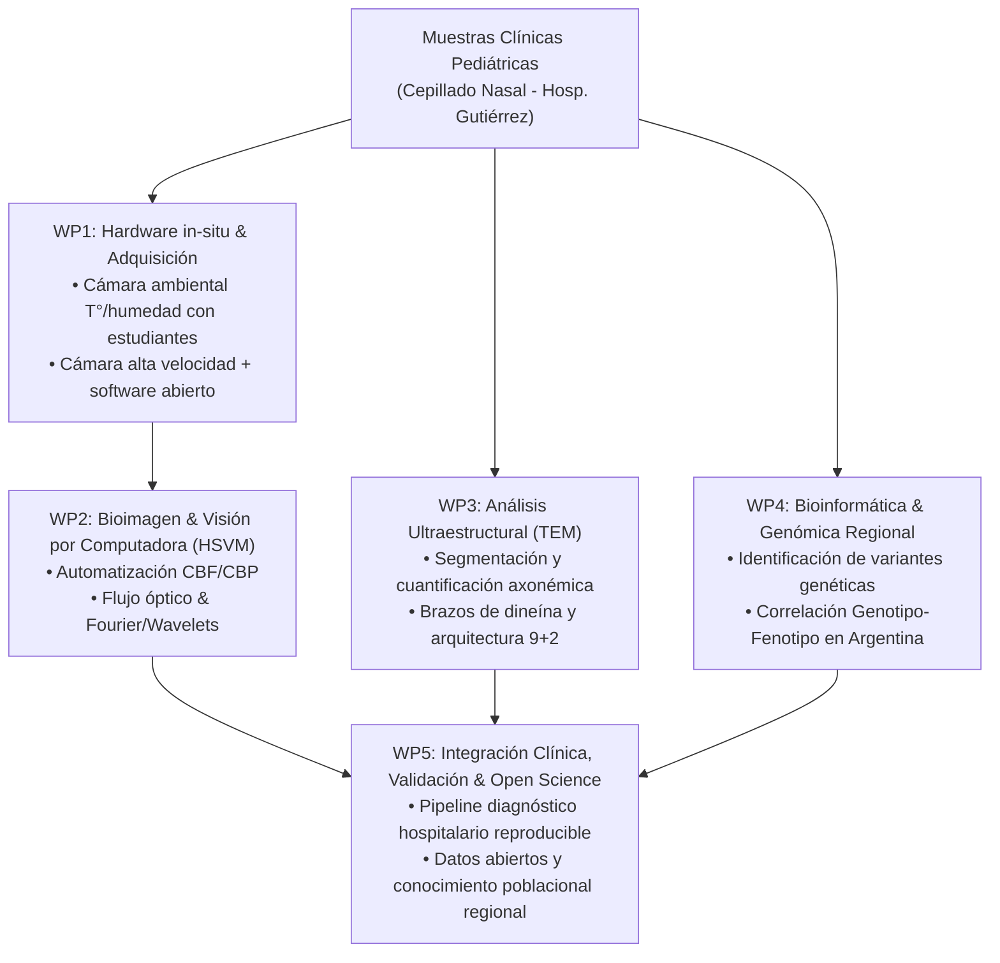

# AGENTS.md - Contexto y Guía Maestra del Proyecto: Becas Leonardo 2026

Este archivo proporciona el contexto integral, los requisitos formales, la arquitectura técnica y las directrices estratégicas para la preparación de la postulación a las **Becas Leonardo de la Fundación BBVA (Convocatoria 2026 - Argentina, Colombia y Perú)**.

Cualquier agente o colaborador que trabaje en los textos, memorias, presupuestos o CV de esta postulación debe seguir estrictamente las especificaciones descritas en este documento.

---

## 1. Datos Clave de la Convocatoria (Bases del Programa Leonardo 2026)

*   **Institución Convocante:** Fundación BBVA (Red Leonardo).
*   **Programa:** Becas Leonardo a Investigadores y Creadores Culturales 2026 (Argentina, Colombia y Perú).
*   **Área Temática de Postulación:** **Ciencias de la Computación, Ciencia de Datos e Inteligencia Artificial** (con aplicación directa a bioimágenes biomédicas y diagnóstico pediátrico de precisión).
*   **Dotación Económica:** Hasta **USD 50.000** brutos (fuente principal y preferentemente única de financiación).
*   **Plazo de Ejecución:** **12 a 18 meses** (inicio estimado primer trimestre/semestre de 2027 tras formalización).
*   **Cierre de Convocatoria (Argentina):** **21 de septiembre de 2026 a las 17:00 h (GMT-3)**.
*   **Plataforma de Postulación:** Exclusivamente online vía [www.programaleonardo.com](https://www.programaleonardo.com).
*   **Perfil del Solicitante:** Investigador individual, persona física, de entre **30 y 45 años** (ambas edades incluidas al cierre), con nacionalidad o residencia fiscal comprobable en Argentina (CUIT).
*   **Criterios de Evaluación del Jurado:**
    1.  **Perfil Curricular (50%):** Trayectoria innovadora, publicaciones representativas, solidez técnica y capacidad de liderazgo del proyecto.
    2.  **Originalidad y Carácter Innovador de la Propuesta (50%):** Novedad metodológica, impacto científico-tecnológico y relevancia para la calidad de vida y el desarrollo social.
*   **Título Oficial del Proyecto:** **Desarrollo de Plataforma Computacional Integral de Bioimagen, Visión Artificial y Genómica para el Diagnóstico de la Disquinesia Ciliar Primaria**.
*   **Institución Sede de Adscripción y Ejecución:** **Facultad de Ciencias Exactas y Naturales de la Universidad de Buenos Aires (FCEN-UBA)**.
*   **Institución en Colaboración Clínica:** **Hospital de Niños Dr. Ricardo Gutiérrez** (Buenos Aires, Argentina). El trabajo se realiza en colaboración directa con médicos especialistas de los Servicios de Neumonología y Patología del hospital. Requiere carta de aval de la FCEN-UBA como sede universitaria y carta de colaboración clínica y ética del Hospital Gutiérrez.

---

## 2. Documentación Exigida por la Convocatoria y Restricciones Formales

Toda la documentación debe presentarse en español y en formato PDF (a excepción del CV, publicaciones y cartas de referencia, que pueden presentarse en inglés o español).

| Documento | Límite / Formato | Contenido Crítico |
| :--- | :--- | :--- |
| **Resumen del Proyecto** | Máx. **2.000 caracteres** (con espacios) | Problema clínico, solución computacional/tecnológica, metodología, impacto en diagnóstico infantil. |
| **Memoria del Proyecto** | Máx. **5 páginas** (tamaño carta / A4) | 1. Descripción detallada del proyecto. 2. Plan de trabajo estructurado en paquetes de trabajo (WPs) y cronograma de 12-18 meses. 3. Estado del arte, innovación y factibilidad. |
| **Presupuesto Total Bruto** | En **USD**, desglosado con impuestos | Hardware (cámara de alta velocidad, componentes de cámara ambiental), software, almacenamiento/cómputo, reactivos/insumos, RRHH técnicos/estudiantiles, publicaciones/open science. |
| **Curriculum Vitae** | Máx. **5 páginas** (A4/carta) + **Resumen de trayectoria (máx. 2.000 caracteres)** | Énfasis en los últimos 5 años. Enfoque en bioanálisis de imágenes, microscopía avanzada, visión por computadora y bioinformática. |
| **Trayectoria Laboral** | Hasta **5 puestos o proyectos más relevantes** | Últimos 5 años (filiación actual, dirección de proyectos, roles en bioimágenes/análisis de datos). |
| **Publicaciones Previas** | Hasta **5 publicaciones o trabajos más representativos** | Artículos clave donde se demuestre liderazgo en bioimagen, microscopía, algoritmos de análisis o genómica. |
| **Títulos Académicos** | Hasta **5 documentos acreditativos** | Título de grado/licenciatura, doctorado, posdoctorado, diplomas de especialización. |
| **Cartas de Referencia** | Mínimo **1**, máximo **2** cartas | Investigadores/expertos de prestigio con conocimiento directo del postulante (membrete, firma, filiación). |
| **Aval Institucional y Ética** | Cartas oficiales membretadas | Carta de aval institucional de la FCEN-UBA (sede) y carta de colaboración clínica/aval ético del Hospital Gutiérrez para muestras humanas pediátricas. |
| **Identificación Fiscal y Personal** | PDF oficial | Copia de DNI/Pasaporte y constancia de CUIT/residencia fiscal en Argentina. |

---

## 3. Contexto Científico y Clínico del Proyecto

### 3.1 La Patología: Disquinesia Ciliar Primaria (DCP / PCD)
*   **Naturaleza:** Enfermedad genética heterogénea (autosómica recesiva en la mayoría de los casos) que afecta la estructura y el movimiento de las cilias móviles del epitelio respiratorio (y otras células ciliadas).
*   **Problema de Subdiagnóstico:** Históricamente catalogada como "enfermedad rara o poco frecuente", su baja incidencia percibida se debió en gran medida a la falta de herramientas diagnósticas específicas. Con métodos modernos, la detección ha crecido sustancialmente. El diagnóstico tardío conduce a daño pulmonar irreversible (bronquiectasias crónicas), infecciones recurrentes y pérdida de función respiratoria en niños.
*   **Flujo Diagnóstico Estándar Internacional (ERS / ATS):**
    1.  Muestreo por cepillado nasal / biopsia nasofaríngea.
    2.  **Videomicroscopía de alta velocidad (HSVM - High-Speed Videomicroscopy):** Análisis funcional del batido ciliar (*Ciliary Beat Frequency - CBF* y *Ciliary Beat Pattern - CBP*).
    3.  **Microscopía Electrónica de Transmisión (TEM):** Análisis ultraestructural de axonemas (brazos de dineína internos/externos, par central, radios).
    4.  **Secuenciación Genética / Bioinformática:** Detección de variantes patogénicas en más de 50 genes asociados (e.g., *DNAH5, DNAI1, CCDC39, CCDC40*).

### 3.2 El Cuello de Botella en el Hospital Gutiérrez
*   El **Hospital de Niños Dr. Ricardo Gutiérrez** es un importante centro de referencia pediátrico en el país, pero cuenta con equipamiento obsoleto y escaso: un microscopio óptico antiguo y una cámara no apta para videomicroscopía de alta resolución temporal.
*   **Ausencia de control ambiental:** Las cilias son extremadamente sensibles a la temperatura y humedad. A temperatura ambiente o en portaobjetos sin sellar/termostatizar, el batido se detiene o altera rápidamente, generando falsos positivos/negativos.
*   **Análisis manual y subjetivo:** La inspección visual cualitativa no permite cuantificar patrones disquinéticos sutiles ni procesar cohortes con reproducibilidad clínica.

### 3.3 El Rol Transformador del Postulante (Bioimagen + Visión Artificial + Genómica)
El proyecto capitaliza la formación interdisciplinaria del postulante para transformar radicalmente la capacidad diagnóstica local y regional:
1.  **Instrumentación in situ & Prototipado:** Dirección de estudiantes (ingeniería/física/biología) para diseñar y ensamblar una cámara de incubación termostatizada con control de humedad y temperatura (37°C) compatible con el microscopio del hospital; incorporación de sensor de cámara de alta velocidad y migración a software de adquisición automatizado (ej. Micro-Manager / scripts Python).
2.  **Visión por Computadora & Automatización (HSVM):** Desarrollo de pipelines algorítmicos (detección de bordes ciliares activos, flujo óptico, análisis espectral FFT/ondículas para CBF, mapas de fase y sincronía interciliar) para caracterizar y clasificar el batido en forma cuantitativa e independiente de operador.
3.  **Análisis de Bioimágenes en Microscopía Electrónica de Transmisión (TEM):** Cuantificación ultraestructural semi-automatizada del axonema ciliar (deficiencias de brazos de dineína, desorganización microtubular), estandarizando el análisis de imágenes TEM.
4.  **Bioinformática y Genética Poblacional:** Análisis genómico (paneles/WES) para identificar variantes causales en pacientes pediátricos locales, correlacionar fenotipo (HSVM/TEM) con genotipo y describir las variantes endémicas más frecuentes en Argentina y Sudamérica.

---

## 4. Arquitectura de la Memoria del Proyecto (5 Páginas)

Para asegurar la máxima calificación en "Originalidad y carácter innovador" (50%), la memoria técnica debe estructurarse en 5 Paquetes de Trabajo (Work Packages):

### Paquetes de Trabajo (WPs):
*   **WP1: Modernización e Instrumentación Óptica in situ (Meses 1-6)**
    *   Diseño y construcción de cámara ambiental de bajo costo pero alta precisión (control de temperatura a 37°C ± 0.5°C y saturación de humedad) supervisando estudiantes de grado.
    *   Integración de sensor digital de alta velocidad (≥120-200 fps) al microscopio existente.
    *   Implementación de software libre de adquisición controlada (Micro-Manager / PyQt / OpenCV).
*   **WP2: Pipeline Computacional para Videomicroscopía de Alta Velocidad (Meses 4-12)**
    *   Algoritmo de segmentación de zonas ciliadas viables y descarte automático de detritos.
    *   Cuantificación de Frecuencia de Batido Ciliar (CBF) por transformada rápida de Fourier (FFT) píxel a píxel.
    *   Análisis de Patrón de Batido Ciliar (CBP) mediante kymographs, tracking de trayectorias ciliares y descriptores de asimetría y disquinesia.
*   **WP3: Procesamiento Cuantitativo de Imágenes de MET (Meses 6-14)**
    *   Estandarización del análisis de cortes transversales de axonemas ciliares (geometría 9+2).
    *   Cuantificación de defectos en brazos externos/internos de dineína (ODA/IDA) y translocaciones microtubulares.
*   **WP4: Análisis Bioinformático de Variantes Genéticas (Meses 8-16)**
    *   Pipeline bioinformático para priorización de variantes en genes de DCP.
    *   Correlación multivariada fenotipo ciliar (HSVM + TEM) con variantes genéticas.
    *   Caracterización de la distribución de variantes en pacientes del Hospital Gutiérrez para entender la epidemiología molecular en Argentina.
*   **WP5: Transferencia Clínica, Validación y Ciencia Abierta (Meses 12-18)**
    *   Capacitación al equipo de neumonología y patología del Hospital Gutiérrez.
    *   Liberación de software/código abierto para la comunidad médica y científica latinoamericana.
    *   Redacción de informe final, publicaciones internacionales y difusión pública BBVA.

---

## 5. Estrategia de Redacción para Agentes y Colaboradores

1.  **Enfoque de la Convocatoria:** El jurado evalúa en el área de **Computación, Ciencia de Datos e IA**. El proyecto no debe presentarse como un servicio clínico asistencial rutinario, sino como una **solución de computación científica, visión artificial y análisis de datos biomédicos de frontera** que resuelve un problema crítico de salud pública pediátrica.
2.  **Narrativa del Impacto Social:** Enfatizar la misión de la Fundación BBVA: "mejorar la calidad de vida de las personas mediante el conocimiento y la innovación tecnológica". El paso de un diagnóstico tardío con daño pulmonar crónico a un diagnóstico precoz, cuantitativo y accesible en un hospital público argentino ejemplifica a la perfección este objetivo.
3.  **Factibilidad y Rendimiento del Presupuesto (USD 50.000):** La propuesta debe demostrar una excepcional relación costo-efectividad. En lugar de pedir un microscopio de cientos de miles de dólares, el proyecto maximiza el equipamiento preexistente mediante inteligencia computacional, ingeniería local y sensores actualizados.
4.  **Rigor de Métricas y Espacio:**
    *   Respetar a rajatabla los 2.000 caracteres en resúmenes.
    *   Respetar las 5 páginas en la memoria y las 5 páginas en el CV.
    *   Usar terminología bioimagenológica y clínica rigurosa (*HSVM, CBF, CBP, axonema 9+2, dineína, optical flow, FFT, MET/TEM, NGS, variantes missense/truncantes*).

---

## 6. Checklist de Documentos a Redactar en el Repositorio

- [x] `AGENTS.md` - Contexto y directrices maestras (este archivo).
- [x] `GUIA_CV.md` - Estrategia, estructura y redacción del CV de 5 páginas y resumen de 2.000 caracteres.
- [x] `PLANTILLA_CV_5_PAGINAS.md` - Plantilla estructurada en 5 páginas lista para completar con datos del postulante.
- [x] `RESUMEN_PROYECTO.md` - Versión oficial del resumen ajustado a 1.965 caracteres para la plataforma.
- [x] `MEMORIA_TECNICA.md` - Memoria técnica completa de 5 páginas (Descripción, WPs, Cronograma, Estado del Arte, Factibilidad).
- [x] `PRESUPUESTO_DESGLOSADO.md` - Plan financiero y desglose exacto en USD ($50.000 brutos).
- [x] `MODELO_CARTA_AVAL_HOSPITAL.md` - Modelo formal de carta institucional y aval ético para las autoridades del Hospital Gutiérrez.

