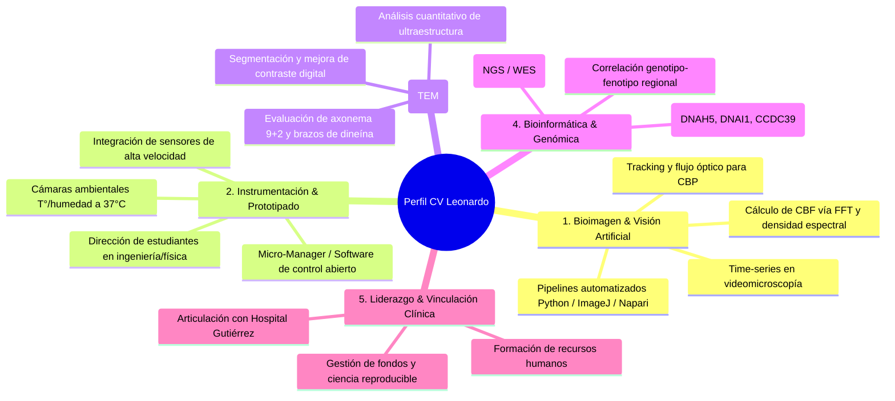

# Guía Estratégica para el Curriculum Vitae - Becas Leonardo 2026

Esta guía detalla con precisión cómo estructurar, redactar y optimizar el Curriculum Vitae para la postulación a las **Becas Leonardo de la Fundación BBVA (Convocatoria 2026)** para el proyecto **"Desarrollo de Plataforma Computacional Integral de Bioimagen, Visión Artificial y Genómica para el Diagnóstico de la Disquinesia Ciliar Primaria"**, radicado en la **Facultad de Ciencias Exactas y Naturales de la Universidad de Buenos Aires (FCEN-UBA)** en colaboración con médicos del **Hospital de Niños Dr. Ricardo Gutiérrez**.

> [!IMPORTANT]
> **El Perfil Curricular representa el 50% de la calificación final** de la postulación. El jurado evaluador pertenece al área de **Ciencias de la Computación, Ciencia de Datos e Inteligencia Artificial**. Por ello, el CV debe estar estratégicamente orientado a visibilizar tus competencias en análisis de bioimágenes, visión por computadora, bioinformática e instrumentación óptica/hardware, articuladas con el impacto clínico en salud pública infantil.

---

## 1. Restricciones Formales y Requisitos de las Bases

1.  **Extensión Máxima:** **5 páginas** en tamaño carta o A4 (formato PDF).
2.  **Idioma:** Puede presentarse en **español o inglés** (se sugiere español o bilingüe con términos técnicos estandarizados).
3.  **Énfasis Temporal:** Énfasis especial en los **últimos 5 años (2021-2026)**.
4.  **Resumen de Trayectoria:** Texto obligatorio de **hasta 2.000 caracteres** (espacios incluidos) que sintetice tu recorrido y capacidades diferenciales.
5.  **Apartados Específicos en la Plataforma Online:**
    *   **Trayectoria laboral:** Cargar hasta **5 puestos o proyectos más relevantes** de los últimos 5 años.
    *   **Publicaciones representativas:** Subir PDF de hasta **5 publicaciones anteriores** que sean las más representativas.
    *   **Títulos académicos:** Subir hasta **5 certificados/títulos** (Grado, Doctorado, Posdoctorado/Diplomaturas).
    *   **Cartas de referencia:** Entre **1 y 2 cartas** firmadas por investigadores o referentes reconocidos en el campo.

---

## 2. Los 5 Ejes Temáticos que Debes Resaltar en tu Perfil

El evaluador debe concluir rápidamente que tienes el perfil técnico exacto, la madurez científica (etapa intermedia, 30-45 años) y la capacidad operativa para liderar este proyecto de manera autónoma y exitosa.



### Eje 1: Bioanálisis de Imágenes y Visión por Computadora (Core Computacional)
*   **Qué resaltar:**
    *   Tu experiencia directa en el procesamiento automatizado de imágenes biomédicas, en particular secuencias temporales de video (*high-speed time-series*).
    *   Dominio de técnicas matemáticas y algorítmicas: análisis en el dominio de la frecuencia mediante Transformada Rápida de Fourier (**FFT**) y ondículas (*wavelets*) para calcular la Frecuencia de Batido Ciliar (**CBF**); algoritmos de flujo óptico (*optical flow*) y kymographs para cuantificar el Patrón de Batido Ciliar (**CBP**).
    *   Uso y desarrollo en entornos de vanguardia: **Python** (NumPy, SciPy, scikit-image, OpenCV, PyTorch/TensorFlow), **ImageJ / Fiji** (macros, plugins personalizados), y visores multidimensionales como **Napari**.
    *   Desarrollo de pipelines que transforman inspecciones manuales y subjetivas en métricas estadísticas reproducibles e independientes del operador.

### Eje 2: Modernización de Equipamiento, Instrumentación Óptica y Prototipado
*   **Qué resaltar:**
    *   Conocimiento profundo de hardware de microscopía óptica: componentes ópticos, iluminación, objetivos, contraste de fases y campo claro.
    *   Capacidad para **actualizar y revalorizar equipamiento obsoleto** en contextos hospitalarios con recursos limitados (alta costo-efectividad).
    *   Experiencia en selección e integración de cámaras de alta velocidad (sensores CMOS industriales de alta sensibilidad, baja latencia y alta tasa de cuadros: ≥120-200 fps).
    *   **Capacidad de dirección interdisciplinaria:** Experiencia en dirigir estudiantes de grado (de ingeniería, física, informática o biotecnología) para diseñar e imprimir en 3D/ensamblar cámaras de incubación ambiental (control de temperatura a 37 °C ± 0.5 °C y cámara húmeda para prevenir evaporación de la gota de biopsia nasofaríngea).
    *   Automatización del control instrumental mediante software abierto como **Micro-Manager** o interfaces Python.

### Eje 3: Microscopía Electrónica de Transmisión (TEM / MET) y Ultraestructura
*   **Qué resaltar:**
    *   Manejo y análisis cuantitativo de imágenes de ultraestructura celular obtenidas por MET.
    *   Habilidad para segmentar e interpretar la arquitectura nanométrica del axonema ciliar (patrón 9+2 de dobletes de microtúbulos, par central, espinas radiales y brazos de dineína externos e internos - ODA/IDA).
    *   Desarrollo o aplicación de algoritmos para realce de contraste, promediado de partículas o clasificación morfológica de defectos ultraestructurales causantes de DCP.

### Eje 4: Bioinformática, Ciencia de Datos y Genómica Médica
*   **Qué resaltar:**
    *   Capacidad para trabajar con datos genómicos masivos (NGS, paneles multigenéticos o secuenciación de exoma completo - WES).
    *   Filtrado, anotación y priorización de variantes de un solo nucleótido (SNVs) e inserciones/deleciones (InDels) en el catálogo de genes asociados a disquinesia ciliar primaria (más de 50 genes reportados, tales como *DNAH5, DNAI1, DNAH11, CCDC39, CCDC40*).
    *   Habilidad para integrar datos multimodales: vincular el fenotipo ciliar dinámico (HSVM) y ultraestructural (TEM) con el perfil genotípico.
    *   Visión de salud pública: interés en caracterizar las variantes genéticas endémicas o prevalentes en la población pediátrica argentina y de la región sudamericana, donde los datos genómicos suelen estar subrepresentados en las bases globales.

### Eje 5: Liderazgo de Proyectos, Formación de Estudiantes y Trabajo Traslacional
*   **Qué resaltar:**
    *   Capacidad probada de articulación entre la universidad pública (FCEN-UBA) y el sistema de salud (médicos especialistas del Hospital de Niños Dr. Ricardo Gutiérrez, un importante centro de referencia en el país).
    *   Trayectoria en la formación de recursos humanos: dirección o co-dirección de tesinas de grado en FCEN-UBA/Ingeniería, becarios de iniciación o pasantías técnicas.
    *   Compromiso con la reproducibilidad, el código abierto (*Open Science*) y la transferencia efectiva de tecnología al personal médico asistencial (neumonólogos, patólogos y bioquímicos del hospital).

---

## 3. Estructura Recomendada para el CV (5 Páginas)

### Página 1: Identidad, Declaración de Perfil y Síntesis de Trayectoria
*   **Encabezado:** Nombre completo, título de máximo grado académico, filiación institucional (CONICET / Universidad / Hospital), enlaces (ORCID, Google Scholar, GitHub, LinkedIn), contacto y CUIT.
*   **Perfil Profesional (Executive Summary / Statement):** 1 párrafo de alto impacto definiéndote como especialista en bioanálisis computacional de imágenes, microscopía avanzada y bioinformática, con experiencia en modernización instrumental y soluciones traslacionales.
*   **Resumen de Trayectoria (versión para el CV):** Síntesis formal que cumpla con el espíritu del texto de hasta 2.000 caracteres exigido en la plataforma.
*   **Competencias Técnicas y Habilidades (Skills Matrix):**
    *   *Bioimagen & Visión Artificial:* Python (OpenCV, scikit-image, SciPy), ImageJ/Fiji Macro Language, Napari, FFT, Optical Flow, Kymograph analysis.
    *   *Microscopía e Instrumentación:* Videomicroscopía de alta velocidad (HSVM), Microscopía Electrónica de Transmisión (TEM), Micro-Manager, diseño de hardware/cámaras ambientales (sensores térmicos, PID, Arduino/ESP32, impresión 3D).
    *   *Bioinformática & Genómica:* Procesamiento de NGS, variant calling, herramientas GATK/BCFtools, análisis de vías, bases de datos (ClinVar, gnomAD, Ensembl).
    *   *Idiomas:* Español (nativo), Inglés (fluido/profesional).

### Página 2: Trayectoria Académica y Posiciones Laborales (Últimos 5 Años)
*   **Formación Académica:**
    *   Doctorado (título, institución, año, director/a, mención o calificación).
    *   Posdoctorados / Estancias de investigación.
    *   Carrera de grado (Licenciatura / Ingeniería / etc.).
    *   Diplomaturas o cursos de posgrado en bioimagen, IA o bioinformática.
*   **Posiciones Laborales / Nombramientos de los Últimos 5 Años:**
    *   Cargo actual de investigación (ej. Investigador/a CONICET, Docente Universitario/a, Asesor/a en Bioimágenes).
    *   Roles previos en centros de investigación, laboratorios o servicios de microscopía.
    *   Roles de vinculación y asesoramiento técnico-científico con centros médicos (ej. Hospital Gutiérrez).

### Página 3: Proyectos de I+D+i, Financiamientos y Desarrollos Tecnológicos
*   **Proyectos de Investigación Financiados:**
    *   Listar proyectos como Investigador Principal (PI) o integrante relevante (PICT, PIP, UBACyT, fundaciones).
    *   Rol desempeñado, entidad financiadora, período y monto adjudicado.
*   **Desarrollos Tecnológicos, Hardware y Software Registrado/Liberado:**
    *   Repositorios de código abierto (GitHub/GitLab) con herramientas de análisis de imágenes o scripts bioinformáticos.
    *   Prototipos de instrumentación (adaptaciones ópticas, cámaras de cultivo/temperatura, automatizaciones).
    *   Protocolos estandarizados de bioimagen transferidos a servicios clínicos o de diagnóstico.

### Página 4: Publicaciones Científicas Seleccionadas
*   **Sección de "5 Publicaciones Más Representativas":**
    *   Destacarlas claramente en la parte superior con un recuadro o tipografía diferenciada.
    *   Para cada una de las 5, agregar una breve viñeta (2 líneas) explicitando: **(i) tu contribución metodológica** (ej. "Diseño y ejecución del pipeline de visión por computadora para análisis ciliar") y **(ii) el impacto del trabajo** (citas, cuartil de la revista Q1/Q2).
*   **Otras Publicaciones Recientes (2021-2026):**
    *   Artículos con revisión por pares en revistas internacionales indexadas.
    *   Capítulos de libro o actas de congresos internacionales con referato.

### Página 5: Formación de RRHH, Gestión, Congresos y Referencias
*   **Dirección de Estudiantes y Formación de Recursos Humanos:**
    *   Tesis de grado, maestrías o doctorados dirigidas o co-dirigidas (fundamental para respaldar tu capacidad de dirigir a los estudiantes que armarán la cámara ambiental).
    *   Pasantías de investigación supervisadas.
*   **Presentaciones en Congresos y Conferencias (Últimos 5 años):**
    *   Ponencias orales y posters en congresos de microscopía, bioimagen, biología celular, neumonología o bioinformática.
*   **Premios, Becas y Reconocimientos Previos:**
    *   Premios a presentaciones, becas posdoctorales, distinciones de sociedades científicas.
*   **Referencias Académicas:**
    *   Detalle de los 2 investigadores referentes que aportarán las cartas de recomendación (Nombre, Cargo, Institución, Correo electrónico, Relación profesional).

---

## 4. Borrador Modelo: Resumen de Trayectoria (Hasta 2.000 Caracteres)

Este texto está redactado específicamente para el campo de texto de **hasta 2.000 caracteres (con espacios)** que exige el formulario de la Fundación BBVA. Puede adaptarse según tus datos personales exactos:

```text
Especialista en bioanálisis de imágenes, microscopía avanzada y bioinformática traslacional, con trayectoria consolidada en el desarrollo de soluciones computacionales aplicadas a la biomedicina. Doctor/a en [Disciplina] por la [Universidad] e investigador/a en la Facultad de Ciencias Exactas y Naturales de la Universidad de Buenos Aires (FCEN-UBA) / CONICET, mi labor se focaliza en la intersección entre la visión por computadora, la instrumentación óptica y la ciencia de datos para optimizar el diagnóstico de patologías complejas.

En los últimos 5 años he liderado el diseño de algoritmos para el análisis cuantitativo de secuencias de bioimágenes temporales, aplicando transformada de Fourier, flujo óptico y kymographs para la extracción automatizada de frecuencias y patrones cinéticos, eliminando la subjetividad del operador. Cuento con probada experiencia en microscopía óptica y electrónica de transmisión (TEM), abarcando desde la caracterización ultraestructural de complejos macromoleculares y axonemas ciliares hasta la priorización bioinformática de variantes genéticas mediante secuenciación masiva (NGS).

Paralelamente, poseo experiencia en el desarrollo de instrumentación científica de muy alta costo-efectividad, habiendo coordinado equipos de estudiantes y colaboradores interdisciplinarios en el ensamblaje de prototipos con control de variables ambientales (temperatura y humedad) y en la integración de hardware de adquisición de alta velocidad con plataformas de código abierto como Micro-Manager y Python. Mi trabajo destaca por una estrecha vinculación con el sistema público de salud, colaborando activamente con médicos del Hospital de Niños Dr. Ricardo Gutiérrez —un importante centro de referencia en el país— para modernizar sus capacidades diagnósticas en enfermedades respiratorias complejas como la Disquinesia Ciliar Primaria. Mi producción científica incluye [X] artículos en revistas de alto impacto, dirección de recursos humanos y desarrollo de software libre.
```
*(Longitud aproximada: ~1.890 caracteres con espacios, dejando margen de ajuste).*

---

## 5. Criterios de Selección para los Componentes Adicionales

### 5.1 Selección de las 5 Publicaciones Representativas
Debes seleccionar 5 publicaciones que cubran estratégicamente los pilares de la propuesta:
1.  **Publicación 1 (Bioimagen / Visión Computacional):** Donde figures como primer autor/a o autor/a de correspondencia, enfocada en procesamiento digital, tracking, análisis de frecuencias temporales o automatización.
2.  **Publicación 2 (Microscopía / Ultraestructura o Dinámica Celular):** Artículo que demuestre tu dominio de microscopía avanzada (óptica de alta resolución o TEM) aplicada a biología celular o patología.
3.  **Publicación 3 (Genómica / Bioinformática):** Trabajo donde se apliquen herramientas computacionales para la identificación, análisis o correlación de variantes génicas o datos moleculares.
4.  **Publicación 4 (Desarrollo Metodológico / Instrumentación o Software):** Artículo donde se describa un método computacional abierto, plugin, software libre o desarrollo instrumental.
5.  **Publicación 5 (Aplicación Médica / Traslacional):** Trabajo en colaboración con el área clínica o pediátrica que demuestre tu capacidad de trabajar con muestras humanas y resolver problemas sanitarios reales en colaboración con centros hospitalarios.

### 5.2 Selección de los 5 Puestos o Proyectos Laborales (Últimos 5 Años)
1.  **Puesto/Proyecto 1:** Cargo de investigación actual en FCEN-UBA / CONICET enfocado en análisis de bioimágenes y bioinformática.
2.  **Puesto/Proyecto 2:** Proyecto de colaboración con médicos del Hospital de Niños Dr. Ricardo Gutiérrez (un importante centro de referencia en el país, con énfasis en diagnóstico respiratorio y patologías complejas).
3.  **Puesto/Proyecto 3:** Proyecto financiado (PICT / PIP / UBACyT) donde hayas actuado como IP, co-IP o responsable técnico del análisis bioinformático o de imágenes.
4.  **Puesto/Proyecto 4:** Dirección de proyecto de instrumentación / docencia con estudiantes en FCEN-UBA o Ingeniería (ej. tutoría de tesis en física aplicada, electrónica o biotecnología).
5.  **Puesto/Proyecto 5:** Rol previo relevante en centro de microscopía avanzada o bioinformática (ej. posdoctorado o responsable de servicio tecnológico).

### 5.3 Selección de los 2 Referenciantes (Cartas de Recomendación)
Las bases permiten **1 o 2 cartas de referencia**. Se recomienda fuertemente presentar **las 2 cartas**:
*   **Referencia 1 (Perfil Científico-Tecnológico / Computación / Bioimagen - FCEN-UBA o CONICET):** Un investigador/a de máximo prestigio (ej. Investigador Principal/Superior CONICET, Director de Instituto o Profesor Titular) que avale tus habilidades metodológicas en análisis de bioimágenes, rigurosidad computacional y autonomía científica.
*   **Referencia 2 (Perfil Clínico / Hospitalario - Hospital Gutiérrez):** Un/a médico/a especialista o jefe/a de servicio del Hospital de Niños Dr. Ricardo Gutiérrez (ej. Neumonología Pediátrica o Patología) que certifique la colaboración activa, la necesidad asistencial del instrumental y el impacto directo que tendrá tu proyecto en los pacientes pediátricos.

---

## 6. Errores Frecuentes a Evitar

*   **Error 1: Redactar un CV puramente biológico o médico.** Si el evaluador del área de Computación/IA lee un CV centrado únicamente en patología clínica sin ver librerías, algoritmos, matemáticas o métodos computacionales, restará puntaje en el encaje temático.
*   **Error 2: No detallar tu rol en las publicaciones.** Si estás en publicaciones con muchos autores, no queda claro tu aporte. En el CV, destaca en 1 o 2 líneas tu rol específico (*"responsable del pipeline de análisis de imágenes"* o *"análisis bioinformático de variantes"*).
*   **Error 3: Desatender la faceta de instrumentación/hardware.** El jurado valorará enormemente que no dependas de compras llave en mano de USD 300.000, sino que tengas la capacidad inventiva de construir la cámara de incubación a 37°C con estudiantes y modernizar la óptica in-situ. Esto debe figurar con claridad.
*   **Error 4: Superar los límites de páginas o caracteres.** 5 páginas estrictas para el CV y 2.000 caracteres para el resumen. El sistema o el jurado penalizan automáticamente los excesos.
