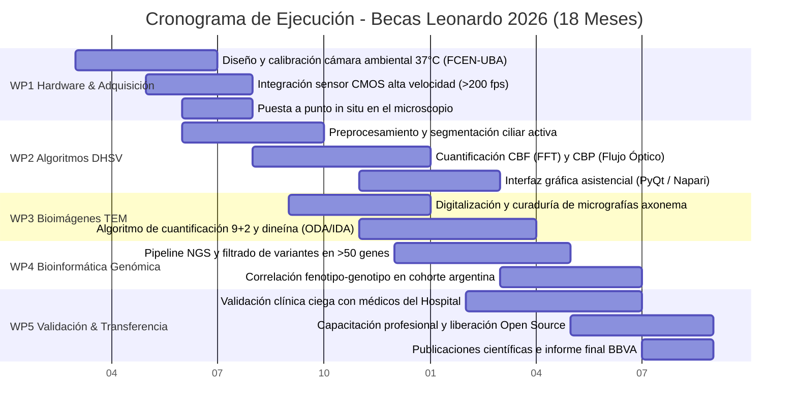

# Memoria Técnica del Proyecto - Becas Leonardo 2026

**Convocatoria:** Becas Leonardo a Investigadores y Creadores Culturales 2026 (Argentina, Colombia y Perú)  
**Fundación BBVA**  
**Área Temática:** Ciencias de la Computación, Ciencia de Datos e Inteligencia Artificial  
**Institución Sede de Ejecución:** Facultad de Ciencias Exactas y Naturales - Universidad de Buenos Aires (FCEN-UBA)  
**Institución en Colaboración Clínica:** Hospital de Niños Dr. Ricardo Gutiérrez (Buenos Aires, Argentina)  

---

# TÍTULO DEL PROYECTO:
## Desarrollo de Plataforma Computacional Integral de Bioimagen, Visión Artificial y Genómica para el Diagnóstico de la Disquinesia Ciliar Primaria

---

## 1. Resumen Ejecutivo, Justificación y Planteamiento del Problema

La **Disquinesia Ciliar Primaria (DCP)** es una ciliopatía genética hereditaria, multisistémica y de elevada heterogeneidad clínica, causada por alteraciones congénitas en la ultraestructura y función de las cilias móviles del epitelio respiratorio [1, 2, 3]. En individuos sanos, millones de cilias baten de forma coordinada a una frecuencia fisiológica de entre 10 y 15 Hz a 37 °C, propulsando la capa de moco y asegurando el aclaramiento mucociliar de microorganismos y partículas inhaladas [5, 7]. En pacientes con DCP, la disfunción ciliar interrumpe este mecanismo defensivo primario, desencadenando una cascada fisiopatológica descrita por el "círculo vicioso" de Cole: retención de secreciones, infección bacteriana crónica, inflamación neutrofílica persistente mediada por elastasa e interleucinas, y destrucción progresiva de la pared bronquial [4].

A nivel clínico, la enfermedad se manifiesta desde las primeras horas de vida: más del **80% de los recién nacidos a término presentan dificultad respiratoria neonatal no explicada** que inicia entre las 12 y 24 horas posteriores al parto, frecuentemente acompañada de atelectasias o colapso lobar [2, 3]. Durante la primera infancia, los pacientes sufren de congestión nasal y tos húmeda productiva diaria durante todo el año, otitis media serosa recurrente con efusión en más del 80% de los niños, y neumonías recurrentes en el 80% antes de la edad preescolar [2]. Como consecuencia del daño inflamatorio acumulado, el **50% de los niños desarrolla bronquiectasias a los 8 años de edad**, manifestación que se vuelve universal en la edad adulta [2]. Además, aproximadamente el 50% de los casos presenta defectos de lateralidad (*situs inversus totalis* o síndrome de Kartagener), al menos un 12% exhibe *situs ambiguus* / heterotaxia, entre un 5% y 17% padece cardiopatías congénitas asociadas, y existe una alta prevalencia de subfertilidad en ambos sexos [1, 2, 3]. Estudios genómicos poblacionales recientes han recalculado la prevalencia global de la DCP en **al menos 1:7.500 nacidos vivos**, duplicando o triplicando las estimaciones históricas que la catalogaban erróneamente como una enfermedad ultra-rara [1, 3].

### La Situación en Argentina y el Retraso Diagnóstico
En la República Argentina, las Guías Oficiales del Comité Nacional de Neumonología de la Sociedad Argentina de Pediatría (SAP) sobre bronquiectasias no relacionadas con fibrosis quística (no-FQ) en niños identifican a la **DCP como la causa del 7% de las bronquiectasias pediátricas** diagnosticadas en el país, ubicándose como la cuarta causa identificable tras las secuelas postinfecciosas (19%), las inmunodeficiencias primarias (17%) y la aspiración recurrente por cuerpo extraño (10%) [4]. Las guías de la SAP destacan un principio clínico crítico: **la dilatación bronquial cilíndrica precoz es potencialmente reversible** si se instaura tempranamente kinesioterapia respiratoria y tratamiento antibiótico específico antes de que se consolide la destrucción transmural fibrótica e irreversible [4].

Sin embargo, existe un **grave retraso diagnóstico**, con una edad mediana de confirmación de **5 años**, extendiéndose en numerosos casos hasta la adolescencia o la adultez [3]. Este retraso conlleva intervenciones inadecuadas y perjudiciales, tales como tratamientos prolongados con corticoides inhalados por diagnósticos erróneos de asma refractaria, o incluso lobectomías y resecciones quirúrgicas pulmonares innecesarias antes de alcanzar el diagnóstico de certeza [1, 2]. Asimismo, la falta de diagnóstico precoz acelera el deterioro de la función pulmonar, con una pérdida anual promedio del volumen espiratorio forzado en el primer segundo (**caída del FEV1 de ~0,8% por año**) y un incremento progresivo en la tasa de colonización crónica por patógenos agresivos como *Pseudomonas aeruginosa* [3, 6].

### El Cuello de Botella en el Hospital de Niños Dr. Ricardo Gutiérrez
El **Hospital de Niños Dr. Ricardo Gutiérrez** (CABA) es **un importante centro de referencia en el país** en la atención de patologías respiratorias pediátricas complejas y asiste a numerosos pacientes derivados de diversas provincias con sospecha de DCP. No obstante, las guías internacionales (*ERS / ATS / PCD Foundation*) señalan que el diagnóstico definitivo requiere de una batería técnica compleja [1, 2, 5]:
1.  **Videomicroscopía Digital de Alta Velocidad (DHSV / HSVM):** Estándar de evaluación funcional sobre cepillado nasal (*nasal brush biopsy*), que exige capturar a **120–500 cuadros por segundo (fps)** bajo **estricto control ambiental de temperatura a 37 °C**, evaluando obligatoriamente tanto la Frecuencia de Batido Ciliar (*CBF*) como el Patrón de Batido (*CBP*) [2, 5].
2.  **Microscopía Electrónica de Transmisión (TEM):** Análisis ultraestructural del axonema 9+2 (brazos de dineína, par central y espinas radiales) [2, 7].
3.  **Secuenciación Genética Masiva (NGS):** Paneles multigenéticos que analizan más de 50 genes asociados [3, 7].

Actualmente, el hospital cuenta únicamente con un microscopio óptico estándar de campo claro antiguo, acoplado a una cámara no apta que adquiere a tasas convencionales (≤30 fps), provocando un submuestreo severo (*aliasing*) frente a cilias que baten a 10–15 Hz [5]. Más crítico aún es la **ausencia total de control ambiental**: a temperatura ambiente no controlada (20–22 °C), la frecuencia de batido ciliar se deprime sustancialmente (la CBF es de 6,3–9,0 Hz a 32 °C y de 10–15 Hz a 37 °C) y la muestra se deseca rápidamente en el portaobjetos, induciendo discinesias secundarias y falsos positivos [5, 7]. Finalmente, la evaluación clínica actual es visual y manual, lo que genera una alta subjetividad y dependencia del operador [5].

### La Articulación Interinstitucional: FCEN-UBA y Hospital Gutiérrez
Para superar esta barrera, este proyecto establece una sinergia estratégica:
*   **Sede de Ejecución y Cómputo (FCEN-UBA):** La Facultad de Ciencias Exactas y Naturales de la UBA aporta el desarrollo de algoritmos de visión por computadora, bioinformática, modelado CAD, electrónica de control y la dirección de estudiantes de grado universitarios.
*   **Colaboración Clínica (Hospital Gutiérrez):** Médicos especialistas de los Servicios de Neumonología y Patología del hospital aportan la cohorte pediátrica, la obtención de muestras de cepillado nasal bajo normas éticas y la validación asistencial directa.

---

## 2. Estado del Arte, Novedad Científica e Hipótesis

### 2.1 Estado del Arte y Limitaciones de los Métodos Actuales
Las directrices de la *European Respiratory Society* (ERS 2017) recomiendan la videomicroscopía de alta velocidad (DHSV) como prueba diagnóstica confirmatoria de primera línea, con una **sensibilidad de 0,95–1,00 y especificidad de 0,93–0,95**, pero estipulan una **fuerte recomendación de NO utilizar el valor de CBF de manera aislada sin el análisis conjunto del patrón de batido (CBP)** [2, 5, 7]. Esto responde a que mutaciones en genes como *DNAH11* generan cilias con frecuencias normales o hipercinéticas pero con un patrón de batido rígido e inefectivo de baja amplitud angular [5, 7].

Sin embargo, el diagnóstico actual a nivel mundial enfrenta tres limitaciones no resueltas [5]:
1.  **Falsos Negativos de TEM y Genética:** La microscopía electrónica de transmisión (TEM) detecta defectos estructurales en el **70–79% de los casos** (ausencia de brazos de dineína externos [ODA], internos [IDA] o desorganización microtubular [MTD]) [2, 7]. Esto implica que **un 20–30% de los pacientes con DCP confirmada presentan ultraestructura en TEM completamente normal o no concluyente**, incluyendo mutaciones en genes como *DNAH11, DRC2, OFD1, GAS2L2, LRRC56, CFAP57, CFAP221, SPEF2* y *RSPH1* [5, 7]. En estos pacientes, la videomicroscopía funcional (DHSV) es el único método capaz de evidenciar la anomalía motil [5].
2.  **Falta de Estandarización Ambiental:** La literatura demuestra que la CBF varía linealmente con la temperatura (la CBF fisiológica de 10–15 Hz solo se alcanza a 37 °C) y que la estabilidad óptima de la muestra de cepillado nasal se preserva durante 3 a 9 horas a temperaturas controladas de transporte [5]. La ausencia de cámaras de incubación termostatizadas en microscopios clínicos compromete la reproducibilidad diagnóstica.
3.  **Subjetividad del Análisis Manual:** La inspección cualitativa del CBP depende enteramente de la experiencia del observador. Métodos computacionales emergentes como el flujo óptico (*optical flow*), el kymograph digital y la microscopía dinámica diferencial (DDM) han demostrado capacidad para parametrizar la asimetría y coordinación ciliar de forma objetiva, pero requieren validación clínica integrada en software clínico amigable [5].

En el aspecto genético, se conocen más de 50 genes asociados a DCP (>2.000 variantes patogénicas) [3, 7]. Mutaciones en *DNAH5* y *DNAI1* codifican componentes de los ODA y representan más del **30% de todos los casos de DCP** [3]. Por su parte, variantes en *CCDC39* y *CCDC40* provocan defectos combinados de IDA y desorganización microtubular (MTD), cursando con fenotipos clínicos muy agresivos de rápida progresión hacia bronquiectasias severas e insuficiencia respiratoria [6, 7]. A pesar de que los paneles NGS detectan actualmente alrededor del 70% de las mutaciones causales, **el 30% restante carece de confirmación molecular** [3], desconociéndose la distribución de variantes alélicas y mutaciones de efecto fundador en la población pediátrica de la Argentina.

### 2.2 Novedad y Carácter Innovador
Frente a equipamientos comerciales cerrados cuyo costo supera los USD 150.000, esta propuesta ofrece una innovación de **muy alta costo-efectividad** basada en:
1.  **Instrumentación in situ y control ambiental estricto:** Prototipado y fabricación aditiva de una cámara de incubación para platina con control térmico en lazo cerrado a 37 °C ± 0,3 °C y saturación de humedad (>90%), dirigida por estudiantes de grado de la FCEN-UBA, acoplada a un sensor industrial CMOS de alta velocidad (>200 fps) operado por software abierto (*Micro-Manager*) [5].
2.  **Visión por computadora para DHSV:** Algoritmo que calcula la CBF píxel a píxel mediante Transformada Rápida de Fourier (FFT) y clasifica el CBP utilizando flujo óptico denso (Farnebäck) y kymographs automáticos ortogonales a la pared celular, eliminando el sesgo del observador [5].
3.  **Cuantificación digital de micrografías de TEM:** Segmentación de axonemas 9+2 y perfilometría radial automatizada para medir densidad de brazos de dineína (ODA/IDA) en micrografías electrónicas [2, 7].
4.  **Bioinformática y Genómica Traslacional:** Priorización de variantes en paneles multigenéticos (>50 genes) y correlación multivariada fenotipo-genotipo en niños del hospital, construyendo el primer mapa molecular de DCP en Argentina [3, 7].

### 2.3 Hipótesis de Trabajo
La integración de instrumentación in situ de bajo costo (cámara ambiental a 37 °C y sensor de alta velocidad) con una suite de visión computacional y análisis bioinformático permitirá alcanzar una concordancia diagnóstica superior al 95% frente a los estándares internacionales en las biopsias nasales del Hospital Gutiérrez, reduciendo la edad mediana de diagnóstico y detectando casos atípicos no identificados por TEM.

---

## 3. Objetivos

### Objetivo General
Desarrollar, validar e implementar una plataforma computacional integral de bioimagen, visión artificial y genómica para el diagnóstico de la Disquinesia Ciliar Primaria, ejecutada en la Facultad de Ciencias Exactas y Naturales (UBA) en estrecha colaboración con médicos del Hospital de Niños Dr. Ricardo Gutiérrez.

### Objetivos Específicos
1.  **OE1:** Diseñar, construir y calibrar una cámara ambiental con control térmico a 37 °C y humedad relativa saturada (>90%), acoplando un sensor digital CMOS industrial de alta velocidad (≥200 fps) al microscopio óptico del hospital mediante software de código abierto (*Micro-Manager*).
2.  **OE2:** Desarrollar un pipeline computacional de visión artificial en Python para la segmentación del epitelio ciliado, cálculo espectral de CBF píxel a píxel por FFT y cuantificación de descriptores cinéticos de CBP mediante flujo óptico y kymographs.
3.  **OE3:** Desarrollar un algoritmo de análisis digital de bioimágenes de Microscopía Electrónica de Transmisión (TEM) para la cuantificación objetiva de la geometría axonémica 9+2 y la integridad de los brazos de dineína externos e internos (ODA/IDA).
4.  **OE4:** Implementar un flujo bioinformático para la priorización funcional de variantes en genes causales de DCP (>50 genes) en pacientes pediátricos del hospital y correlacionar los hallazgos genotípicos con los fenotipos dinámicos (DHSV) y ultraestructurales (TEM).
5.  **OE5:** Capacitar a los médicos especialistas del Hospital Gutiérrez y liberar el software como herramienta de código abierto (*Open Science*).

---

## 4. Metodología y Plan de Trabajo (Work Packages)

El proyecto se estructura en **5 Paquetes de Trabajo (WPs)** a lo largo de **18 meses**:

---

### WP1: Modernización Instrumental in-situ y Control Ambiental (Meses 1-6)
*   **Sede:** Laboratorio en FCEN-UBA / Instalación en Hospital Gutiérrez.
*   **Responsable:** Investigador Postulante (dirigiendo a 2 estudiantes avanzados de grado de FCEN-UBA / Ingeniería).
*   **Metodología:**
    1.  *Cámara de incubación ambiental:* Modelado en software CAD de una cámara cerrada adaptada a la platina. Chasis fabricado por impresión 3D. Implementación de circuito de control en lazo cerrado PID con microcontrolador ESP32 o Arduino y sensores térmicos, garantizando **37 °C ± 0,3 °C** en la gota de biopsia, neutralizando el sesgo térmico demostrado en la literatura (donde la CBF desciende a 6,3–9,0 Hz a 32 °C o menos) [5, 7]. Incorporación de reservorio de humidificación para mantener humedad relativa >90%, evitando la desecación de las células durante la observación (estable entre 3 y 9 horas post-muestreo) [5].
    2.  *Sensor CMOS de alta velocidad:* Montaje de cámara industrial monocromática USB 3.0 con obturador global (*global shutter*), velocidad de muestreo de **200 a 400 fps** a resolución útil diagnóstica (800x600 px), y lente de reducción óptica C-mount de 0,5x acoplada al puerto trinocular del microscopio del hospital, cumpliendo estrictamente con el rango de 120–500 fps estipulado por las guías [5].
    3.  *Software de control:* Configuración de adquisición en **Micro-Manager** / Python para grabación sincrónica continua en memoria RAM de alta velocidad.
*   **Entregables:** Cámara ambiental calibrada y operativa a 37 °C; microscopio del hospital adquiriendo video a >200 fps.

---

### WP2: Pipeline Computacional de Visión Artificial para DHSV (Meses 4-12)
*   **Sede:** FCEN-UBA.
*   **Responsable:** Investigador Postulante.
*   **Metodología:**
    1.  *Preprocesamiento:* Corrección de desplazamiento espasmódico del tejido mediante correlación de fase y realce de bordes.
    2.  *Segmentación automatizada:* Detección de regiones epiteliales con motilidad activa mediante varianza temporal píxel a píxel, discriminando moco estático, eritrocitos y detritos celulares.
    3.  *Cuantificación de CBF (Frecuencia):* Análisis espectral de potencia mediante **Transformada Rápida de Fourier (FFT)** aplicada a la serie temporal de intensidad de cada píxel de la región ciliar. Generación de mapas de calor con el pico de frecuencia dominante (rango normal: 10–15 Hz a 37 °C), CBF media y porcentaje de áreas inmóviles (<4 Hz) [5, 7].
    4.  *Cuantificación de CBP (Patrón de Batido):* Siguiendo la recomendación de ERS de no evaluar CBF aisladamente [2, 5], se calculará el campo vectorial de velocidad mediante **flujo óptico denso (Farnebäck)** y se generarán kymographs digitales automáticos perpendiculares a la membrana para medir: (a) amplitud angular del batido, (b) asimetría de la carrera efectiva vs. recuperación (*effective/recovery stroke*), y (c) índice de disquinesia ciliar (CDI) que discrimine batidos normales, rígidos (*DNAH11*), rotacionales (*HYDIN, RSPH*) o inmovilidad completa (*DNAH5, DNAI1*) [5, 7].
*   **Entregables:** Módulo de visión por computadora en Python con interfaz gráfica de usuario (GUI en PyQt/Napari) lista para el uso médico asistencial.

---

### WP3: Procesamiento Cuantitativo de Bioimágenes en TEM (Meses 6-14)
*   **Sede:** FCEN-UBA en articulación con el Servicio de Patología del Hospital Gutiérrez.
*   **Responsable:** Investigador Postulante.
*   **Metodología:**
    1.  *Estandarización y curaduría:* Digitalización calibrada de cortes transversales de axonemas ciliares respiratorios provenientes del microscopio electrónico de transmisión.
    2.  *Segmentación geométrica del axonema:* Algoritmo basado en transformada circular de Hough para localizar el par central de microtúbulos simples y los 9 dobletes periféricos de microtúbulos A y B (arquitectura canónica 9+2) [2, 7].
    3.  *Cuantificación de brazos de dineína (ODA/IDA):* Extracción de perfiles radiales de intensidad óptica normalizada en las coordenadas específicas de los microtúbulos A para cuantificar de manera no sesgada la ausencia o hipoplasia de brazos externos (ODA) e internos (IDA). Aplicación de promediado de partículas 2D (*sub-axonemal averaging*) para incrementar la relación señal-ruido en muestras patológicas [2, 7].
*   **Entregables:** Algoritmo cuantitativo validado que reporta automáticamente el porcentaje de axonemas con defectos de ODA, IDA o desorganización microtubular (MTD).

---

### WP4: Bioinformática, Genómica y Correlación Fenotipo-Genotipo (Meses 8-16)
*   **Sede:** FCEN-UBA en colaboración con el equipo médico del hospital.
*   **Responsable:** Investigador Postulante.
*   **Metodología:**
    1.  *Pipeline bioinformático:* Flujo estandarizado de alineamiento (BWA-MEM) y llamado de variantes (GATK HaplotypeCaller, BCFtools) a partir de datos NGS (paneles multigenéticos o WES) de pacientes pediátricos con sospecha de DCP del Hospital Gutiérrez.
    2.  *Anotación y priorización clínica:* Filtrado de variantes de acuerdo con guías ACMG/AMP en el catálogo de **más de 50 genes asociados** [3, 7], priorizando los genes ODA mayores (*DNAH5, DNAI1*, responsables de >30% de casos) [3], genes con TEM normal (*DNAH11*) [5, 7], y genes de alta agresividad clínica con desorganización microtubular (*CCDC39, CCDC40*) [6, 7].
    3.  *Correlación Fenotipo-Genotipo:* Modelado estadístico multivariado vinculando la cinética de DHSV (WP2) y la ultraestructura de TEM (WP3) con la presencia de variantes patogénicas bialélicas o mutaciones con codones de terminación prematura (PTC, presentes en hasta 28% de casos) [6].
    4.  *Epidemiología molecular en Argentina:* Caracterización inédita de frecuencias alélicas en la cohorte local para identificar potenciales variantes fundadoras o recurrentes en el país.
*   **Entregables:** Base de datos y reporte bioinformático de variantes genéticas de DCP en niños de Argentina con su correspondiente caracterización fenotípica funcional.

---

### WP5: Validación Clínica, Transferencia y Ciencia Abierta (Meses 12-18)
*   **Sede:** Hospital Gutiérrez / FCEN-UBA.
*   **Responsable:** Investigador Postulante.
*   **Metodología:**
    1.  *Validación clínica ciega:* Estudio de concordancia diagnóstica entre el análisis computacional automatizado y el panel diagnóstico tradicional en una cohorte prospectiva de 40 pacientes con sospecha de DCP derivados al Hospital Gutiérrez.
    2.  *Capacitación profesional:* Talleres teórico-prácticos para médicos neumonólogos, patólogos y técnicos del hospital en la operación del sistema ambiental y el software analítico.
    3.  *Ciencia Abierta (Open Science):* Publicación del código fuente completo en GitHub bajo licencia abierta (MIT/GPL), con manuales de usuario y tutoriales de instalación; envío de dos manuscritos científicos a revistas internacionales indexadas de acceso abierto (Q1/Q2); elaboración del informe final de la Beca Leonardo.
*   **Entregables:** Plataforma validada e integrada en la práctica clínica; software libre publicado; 2 publicaciones científicas internacionales enviadas; memoria final para la Fundación BBVA.

---

## 5. Cronograma de Hitos y Entregables (18 Meses)

| Mes | Hito Clave / Entregable | Paquete | Respaldo en Literatura |
| :---: | :--- | :---: | :--- |
| **M03** | Prototipo de cámara ambiental termostatizada (37 °C) calibrado en laboratorio de FCEN-UBA. | WP1 | Requisito de temperatura fisiológica [5, 7] |
| **M06** | Sensor CMOS de alta velocidad (>200 fps) adaptado al microscopio del Hospital Gutiérrez con Micro-Manager. | WP1 | Estándar ERS de muestreo a 120–500 fps [5] |
| **M09** | Pipeline de visión por computadora para cálculo de CBF (FFT) y CBP (flujo óptico) operativo en videos piloto. | WP2 | Análisis conjunto mandatario CBF+CBP [2, 5] |
| **M11** | Interfaz gráfica interactiva (GUI en PyQt/Napari) validada para uso por el personal médico asistencial. | WP2 | Eliminación de subjetividad y sesgo del operador [5] |
| **M13** | Algoritmo de procesamiento cuantitativo de micrografías de TEM (axonema 9+2 y brazos de dineína) calibrado. | WP3 | Detección objetiva de ODA/IDA en TEM [2, 7] |
| **M15** | Pipeline bioinformático ejecutado y correlación fenotipo-genotipo completada en la cohorte pediátrica. | WP4 | Análisis de >50 genes y correlación clínica [3, 6, 7] |
| **M17** | Ensayo de validación clínica comparativa completado y taller de capacitación a profesionales realizado. | WP5 | Transferencia clínica y estándares de cuidado [1, 4] |
| **M18** | Liberación de código abierto en GitHub, remisión de artículos científicos y reporte final a Fundación BBVA. | WP5 | Ciencia abierta y difusión preceptiva BBVA [1, 5] |

---

## 6. Factibilidad, Gestión de Riesgos y Plan de Mitigación

*   **Factibilidad Institucional y Ética:** La FCEN-UBA proporciona la infraestructura académica, capacidad de cómputo y talleres de instrumentación. La colaboración con los médicos del Hospital de Niños Dr. Ricardo Gutiérrez garantiza el acceso a la cohorte clínica pediátrica y a las muestras de cepillado nasal obtenidas en la práctica asistencial rutinaria. El protocolo de investigación se desarrollará bajo estricta observancia de los principios de la Declaración de Helsinki, las Buenas Prácticas Clínicas (BPC) y la Ley CABA N.º 3.301, contando con la evaluación y aprobación del Comité de Ética en Investigación (CEI) del Hospital Gutiérrez y el consentimiento informado de los representantes legales [1, 4].
*   **Factibilidad Técnica del Postulante:** El postulante posee trayectoria comprobada en bioanálisis de imágenes, microscopía óptica y electrónica, y bioinformática traslacional, con experiencia previa en desarrollo de software científico y dirección de estudiantes universitarios.
*   **Matriz de Riesgos y Mitigaciones:**
    1.  *Riesgo: Muestras de cepillado nasal con moco espeso o discinesias secundarias por inflamación.*  
        *Mitigación:* Las guías ERS recomiendan descartar artefactos inflamatorios y de muestreo [2, 5]. El algoritmo (WP2) incorpora filtros de varianza temporal para excluir zonas de moco estático y analizar únicamente parches con batido rítmico persistente. Si persiste la duda diagnóstica, se seguirán las pautas de repetir el estudio tras tratamiento antibiótico o diferir el análisis en cultivo [4, 5].
    2.  *Riesgo: Demoras aduaneras en la importación del sensor CMOS o componentes electrónicos.*  
        *Mitigación:* Se iniciarán los trámites de importación en el Mes 1. Se dispone provisionalmente de cámaras industriales de alta velocidad de laboratorios de la FCEN-UBA para avanzar en el desarrollo algorítmico del software.
    3.  *Riesgo: Dificultad para confirmar mutaciones causales en el 30% de pacientes sin variantes NGS conocidas.*  
        *Mitigación:* La literatura documenta que hasta un 30% de los casos de DCP no presentan mutaciones en los paneles genéticos actuales [3]. La integración de la videomicroscopía funcional cuantitativa (DHSV a >200 fps) permite confirmar el diagnóstico funcional inequívoco aun en ausencia de confirmación molecular [5].

---

## 7. Impacto Esperado, Beneficio Social y Transferencia Sanitaria

1.  **Impacto Directo en la Salud Infantil:** En consonancia con las guías de la Sociedad Argentina de Pediatría [4], un diagnóstico precoz en la primera infancia permite instaurar kinesioterapia respiratoria diaria (PEP, drenaje autógeno) y tratamiento antibiótico dirigido para erradicar patógenos como *P. aeruginosa*, **logrando la reversión de las dilataciones bronquiales cilíndricas incipientes y previniendo el daño pulmonar permanente (bronquiectasias irreversibles)** [1, 2, 4, 6].
2.  **Soberanía Tecnológica en Salud Pública:** Se demuestra que la conjunción entre la universidad pública (FCEN-UBA) y el hospital pediátrico permite modernizar instrumental preexistente a una fracción del costo de equipos comerciales cerrados importados, creando capacidad diagnóstica local sustentable.
3.  **Aporte a la Genómica Pediátrica Nacional:** Generación del primer registro genotípico y fenotípico de DCP en niños de la Argentina, identificando variantes patogénicas prevalentes en nuestra región [3, 7].
4.  **Ciencia Abierta y Formación de Recursos Humanos:** Formación de estudiantes de grado universitarios en ingeniería biomédica y computación, capacitación continua de médicos del hospital y liberación del software en acceso abierto para cualquier hospital público de América Latina.
5.  **Reconocimiento Institucional Preceptivo:** Todos los resultados, publicaciones científicas y presentaciones mencionarán de forma explícita: *«Proyecto realizado con la Beca Leonardo de la Fundación BBVA 2026. Argentina»*.

---

## 8. Referencias Bibliográficas (Fuentes del Proyecto)

1.  **Robson, E. A., Spoletini, G., Bercusson, A., Carr, S. B., Carroll, M., Dexter, K., Dixon, L., Hogg, C., Jones, A., Kenia, P., Loebinger, M., Lucas, J. S., Moya, E., O’Callaghan, C., Patel, D., Peckham, D. G., Range, S., & Walker, W. T. (2026).** Primary ciliary dyskinesia: a national expert consensus statement on standards of care. *ERJ Open Research*, DOI: 10.1183/23120541.00892-2025.
2.  **Shapiro, A. J., Zariwala, M. A., Ferkol, T., Davis, S. D., Sagel, S. D., Dell, S. D., Rosenfeld, M., Olivier, K. N., Milla, C., Daniel, S. J., Kimple, A. J., Manion, M., Knowles, M. R., & Leigh, M. W. (2016).** Diagnosis, monitoring, and treatment of primary ciliary dyskinesia: PCD foundation consensus recommendations based on state of the art review. *Pediatric Pulmonology*, 51(2), 115–132. DOI: 10.1002/ppul.23304.
3.  **Collison, R., Hyatali, S. A., Kamenova, A., Rashed, A., Riley, D., Kumar, K., Stowell, J. M., & Loebinger, M. R. (2025).** Primary ciliary dyskinesia: aetiology, diagnosis and clinical management. *Clinical Medicine*, 25(1), 100288. DOI: 10.1016/j.clinme.2024.100288.
4.  **Comité Nacional de Neumonología, Sociedad Argentina de Pediatría (Smith, S., Salim, M., Bujedo, E., Martinchuk Migliazza, G., Tognini, C., Nociti, Y., Garetto, S., Olguín Ciancio, M., Pinto, F., et al.) (2020).** Bronquiectasias no relacionadas con fibrosis quística en niños: guías de diagnóstico, seguimiento y tratamiento. *Archivos Argentinos de Pediatría*, 118(Supl 1), S1–S24. DOI: 10.5546/aap.2020.S1.
5.  **Bricmont, N., Alexandru, M., Louis, B., Papon, J.-F., & Kempeneers, C. (2021).** Ciliary videomicroscopy: a long beat from the European Respiratory Society guidelines to the recognition as a confirmatory test for primary ciliary dyskinesia. *Diagnostics*, 11(4), 666. DOI: 10.3390/diagnostics11040666.
6.  **Paff, T., Omran, H., Nielsen, K. G., & Haarman, E. G. (2021).** Current and future treatments in primary ciliary dyskinesia. *International Journal of Molecular Sciences*, 22(18), 9834. DOI: 10.3390/ijms22189834.
7.  **Wrona, J., Krupa, Z., Zawadzka, M., Rydzek, J., Dorobisz, K., & Bania, J. (2025).** Primary ciliary dyskinesia—current diagnostic and therapeutic approach. *Journal of Clinical Medicine*, 14(3), 856. DOI: 10.3390/jcm14030856.
