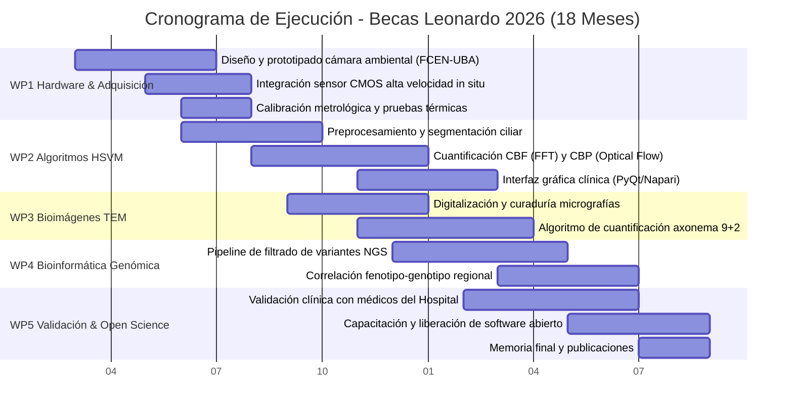

# Memoria Técnica del Proyecto - Becas Leonardo 2026

**Convocatoria:** Becas Leonardo a Investigadores y Creadores Culturales 2026 (Argentina, Colombia y Perú)  
**Fundación BBVA**  
**Área Temática:** Ciencias de la Computación, Ciencia de Datos e Inteligencia Artificial  
**Duración del Proyecto:** 18 meses  
**Dotación Solicitada:** USD 50.000  
**Institución Sede de Ejecución:** Facultad de Ciencias Exactas y Naturales - Universidad de Buenos Aires (FCEN-UBA)  
**Institución en Colaboración Clínica:** Hospital de Niños Dr. Ricardo Gutiérrez (Buenos Aires, Argentina)  

---

# TÍTULO DEL PROYECTO:
## Desarrollo de Plataforma Computacional Integral de Bioimagen, Visión Artificial y Genómica para el Diagnóstico de la Disquinesia Ciliar Primaria

---

## 1. Resumen Ejecutivo y Planteamiento del Problema

La **Disquinesia Ciliar Primaria (DCP)** es una patología genética multisistémica, predominantemente autosómica recesiva, caracterizada por alteraciones congénitas en la ultraestructura y motilidad de las cilias del epitelio respiratorio. En individuos sanos, millones de cilias baten coordinadamente a frecuencias de entre 10 y 16 Hz, generando el aclaramiento mucociliar que expulsa patógenos y partículas del tracto respiratorio. En pacientes con DCP, la disfunción ciliar ocasiona retención crónica de secreciones, infecciones recurrentes del tracto respiratorio superior e inferior, atelectasias recurrentes y, fundamentalmente, el desarrollo progresivo de **bronquiectasias irreversibles**, insuficiencia respiratoria crónica y eventual requerimiento de trasplante pulmonar en la juventud.

Históricamente considerada una enfermedad poco frecuente (con prevalencias estimadas entre 1:10.000 y 1:40.000 nacidos vivos), la evidencia internacional reciente revela que su baja incidencia percibida se debió a un **severo subdiagnóstico**: al perfeccionarse las herramientas de diagnóstico cuantitativo, la detección de casos se incrementó de forma notable. En Argentina y la región, la gran mayoría de los pacientes pediátricos con DCP son diagnosticados tardíamente —frecuentemente cuando ya existe daño pulmonar estructural establecido— tras años de tratamientos ineficaces por sospechas de asma refractaria o fibrosis quística no confirmada.

Las guías internacionales de consenso (*European Respiratory Society - ERS* y *American Thoracic Society - ATS*) establecen una tríada diagnóstica de alta complejidad:
1.  **Videomicroscopía Óptica de Alta Velocidad (HSVM - High-Speed Videomicroscopy):** Análisis funcional de la Frecuencia de Batido Ciliar (*CBF*) y del Patrón de Batido (*CBP*) en muestras de cepillado nasal (*nasal brush biopsy*).
2.  **Microscopía Electrónica de Transmisión (TEM):** Evaluación ultraestructural del axonema ciliar (brazos de dineína externos e internos, par central microtubular y espinas radiales).
3.  **Análisis Genético y Bioinformático:** Identificación de variantes patogénicas en más de 50 genes asociados mediante secuenciación masiva (NGS).

### La Articulación Interinstitucional: FCEN-UBA y Hospital Gutiérrez
El proyecto se radicará y ejecutará en la **Facultad de Ciencias Exactas y Naturales de la Universidad de Buenos Aires (FCEN-UBA)**, institución académica de excelencia que aporta la capacidad computacional, de bioanálisis de imágenes, bioinformática e ingeniería de prototipado. El trabajo se desarrollará en estrecha colaboración con médicos especialistas de los Servicios de Neumonología y Patología del **Hospital de Niños Dr. Ricardo Gutiérrez** (CABA). 

El Hospital de Niños Dr. Ricardo Gutiérrez es **un importante centro de referencia en el país** en atención pediátrica de alta complejidad y recibe a pacientes con patologías respiratorias crónicas derivadas de todo el territorio nacional. A pesar del alto nivel médico de sus profesionales, el hospital dispone de equipamiento óptico limitado para el diagnóstico funcional de DCP:
*   Cuenta únicamente con un microscopio óptico estándar de campo claro, antiguo y sin accesorios dedicados.
*   **Ausencia de control ambiental:** Las cilias son extremadamente sensibles a la temperatura y la humedad. A temperatura ambiente (20-22 °C) o con desecación en el portaobjetos, el batido se altera o detiene en pocos minutos, generando falsos positivos o resultados inconcluyentes.
*   **Cámara digital lenta:** El sensor existente adquiere a tasas de video estándar (≤30 cuadros por segundo - fps), provocando un submuestreo severo (*aliasing*) para estructuras que baten a >10 Hz (el criterio de Nyquist exige al menos 120-200 fps).
*   **Inspección subjetiva:** La evaluación se realiza mediante observación visual directa no grabada, con elevada variabilidad interobservador y falta de métricas estandarizadas.

### La Solución Computacional Propuesta
En lugar de depender de sistemas comerciales propietarios cerrados cuyos costos superan los USD 150.000, esta propuesta genera una solución basada en **computación científica, visión por computadora y bioinformática de muy alta costo-efectividad**:
*   En la FCEN-UBA se diseñarán y programarán los algoritmos de visión artificial, los flujos bioinformáticos y el prototipo de hardware de control ambiental (dirigiendo a estudiantes de grado).
*   En el Hospital Gutiérrez se modernizará in situ el sistema óptico mediante un sensor CMOS de alta velocidad y la cámara ambiental calibrada a 37 °C, evaluando biopsias nasales pediátricas en colaboración con los médicos especialistas.

---

## 2. Estado del Arte, Novedad e Hipótesis Científica

### 2.1 Estado del Arte
En los principales centros de referencia mundiales, el diagnóstico de DCP se sustenta en sistemas cerrados de HSVM de alto costo. Diversos grupos pioneros han demostrado que algoritmos de visión artificial basados en Transformada Rápida de Fourier (FFT), flujo óptico (*optical flow*) y kymographs permiten cuantificar con objetividad matemática la frecuencia ciliar y detectar disquinesias atípicas. No obstante, dichas herramientas no se encuentran integradas en plataformas accesibles para microscopios estándar en los hospitales públicos de nuestra región.

En relación con la Microscopía Electrónica de Transmisión (TEM), aunque constituye el estándar de referencia para defectos ultraestructurales (ausencia de brazos de dineína externos [ODA] o internos [IDA]), el análisis de micrografías continúa realizándose de forma manual mediante recuento visual de cientos de cortes transversales, proceso lento y dependiente del operador. El procesamiento digital de imágenes mediante segmentación geométrica y perfilometría radial ofrece una oportunidad innovadora para objetivar este diagnóstico.

En el plano genético, se han identificado más de 50 genes causales de DCP (*DNAH5, DNAI1, CCDC39, CCDC40, RSPH1, HYDIN*, entre otros). Sin embargo, los datos provienen predominantemente de cohortes europeas y norteamericanas. Se carece de estudios que caractericen las variantes genéticas en la población pediátrica argentina, donde particularidades demográficas pueden definir perfiles mutacionales propios.

### 2.2 Novedad y Carácter Innovador
La novedad fundamental del proyecto radica en su **abordaje multimodal e integrador (Hardware in situ + Visión Artificial + TEM + Bioinformática)** con muy alta costo-efectividad:
1.  **Instrumentación in situ y formación académica:** Diseño y ensamble de una cámara ambiental termostatizada (37 °C ± 0.3 °C y saturación de humedad) mediante prototipado ágil y manufactura aditiva (impresión 3D + control PID), bajo la dirección de estudiantes de grado de la FCEN-UBA.
2.  **Visión computacional automatizada:** Algoritmos que segmentan automáticamente zonas con actividad ciliar, filtran movimiento de detritos y generan mapas cuantitativos de CBF y patrones de batido (CBP).
3.  **Procesamiento digital de TEM:** Estandarización del análisis de cortes axonémicos 9+2 y cálculo cuantitativo de brazos de dineína.
4.  **Genómica poblacional regional:** Primer registro molecular de variantes de DCP en pacientes pediátricos en Argentina y correlación multivariada fenotipo-genotipo.

### 2.3 Hipótesis de Trabajo
El desarrollo e implementación de una plataforma computacional integral y abierta, que combine instrumentación in situ de bajo costo (cámara ambiental y sensor de alta velocidad) con algoritmos de visión por computadora y análisis genómico, permitirá **alcanzar estándares internacionales de sensibilidad y especificidad en el diagnóstico de la DCP en el país**, reduciendo la edad de detección en pacientes pediátricos y eliminando la subjetividad del operador.

---

## 3. Objetivos

### Objetivo General
Desarrollar, validar e implementar una plataforma computacional integral de bioimagen, visión artificial y genómica para el diagnóstico de la Disquinesia Ciliar Primaria, ejecutada en la Facultad de Ciencias Exactas y Naturales (UBA) en estrecha colaboración con médicos del Hospital de Niños Dr. Ricardo Gutiérrez.

### Objetivos Específicos
1.  **OE1:** Diseñar, construir y calibrar una cámara ambiental con control térmico (37 °C) y de humedad adaptada al microscopio del Hospital Gutiérrez, integrando un sensor CMOS digital de alta velocidad (≥200 fps) operado mediante software libre.
2.  **OE2:** Implementar un pipeline algorítmico de visión por computadora para la segmentación del epitelio ciliar, extracción píxel a píxel de la Frecuencia de Batido Ciliar (CBF) mediante FFT y caracterización del Patrón de Batido (CBP) mediante flujo óptico y kymographs.
3.  **OE3:** Desarrollar un módulo de procesamiento digital de imágenes de microscopía electrónica de transmisión (TEM) para la cuantificación objetiva de la arquitectura del axonema 9+2 y la integridad de los brazos de dineína.
4.  **OE4:** Establecer un flujo bioinformático para la anotación funcional y priorización de variantes genéticas patogénicas en la cohorte pediátrica del hospital, analizando su correlación con los fenotipos dinámicos y ultraestructurales.
5.  **OE5:** Validar clínicamente el sistema en colaboración con los médicos especialistas del Hospital Gutiérrez, capacitar al personal de salud y transferir la suite computacional bajo licencia de código abierto (*Open Science*).

---

## 4. Plan de Trabajo y Metodología Detallada (Work Packages)

El proyecto se estructura en **5 Paquetes de Trabajo (WPs)** con un período de ejecución de **18 meses**:

---

### WP1: Modernización Instrumental in-situ y Control Ambiental (Meses 1-6)
*   **Sede de Desarrollo:** Laboratorio en FCEN-UBA / Puesta a punto en Hospital Gutiérrez.
*   **Responsable:** Investigador Postulante (dirigiendo a estudiantes de grado de la FCEN-UBA / Ingeniería).
*   **Tareas:**
    1.  *Diseño y fabricación de cámara ambiental:* Modelado CAD de una cámara cerrada de volumen reducido para platina. Fabricación aditiva en PETG de grado médico con base termoconductora. Integración de lámina calefactora con control en lazo cerrado (PID) gobernado por microcontrolador y sensores térmicos de precisión (Pt100), asegurando 37 °C ± 0.3 °C en la muestra. Cámara húmeda para saturación (>90% humedad relativa) para evitar la evaporación de las biopsias.
    2.  *Integración del sensor digital de alta velocidad:* Montaje de cámara industrial CMOS con obturador global (*global shutter*), puerto USB 3.0, capaz de adquirir a ≥200-400 fps en el área diagnóstica. Acople óptico C-mount de reducción adaptado al microscopio del hospital.
    3.  *Software de adquisición controlada:* Integración con plataformas abiertas (**Micro-Manager** / scripts Python) para captura continua y almacenamiento directo en memoria RAM de alta velocidad.
*   **Entregables:** Prototipo de cámara ambiental funcionando a 37 °C; sistema óptico adaptado adquiriendo a >200 fps.

---

### WP2: Pipeline Computacional de Visión Artificial para Videomicroscopía (Meses 4-12)
*   **Sede de Desarrollo:** FCEN-UBA.
*   **Responsable:** Investigador Postulante.
*   **Tareas:**
    1.  *Preprocesamiento y estabilización:* Corrección de desplazamientos espasmódicos del tejido mediante registro de correlación de fase y realce de bordes ciliares.
    2.  *Segmentación ciliar automatizada:* Delimitación automática de áreas con actividad ciliar vigorosa mediante mapas de varianza temporal, excluyendo detritos, moco estático y eritrocitos.
    3.  *Extracción de Frecuencia (CBF):* Cálculo de densidad espectral mediante **Transformada Rápida de Fourier (FFT)** píxel a píxel en la serie temporal. Mapeo de frecuencias dominantes, cálculo de frecuencia media, dispersión y cuantificación de áreas inmóviles (<4 Hz).
    4.  *Análisis del Patrón de Batido (CBP):* Aplicación de **flujo óptico denso (Farnebäck)** y trazado automatizado de kymographs perpendiculares al epitelio para cuantificar amplitud de batido, asimetría de carrera efectiva vs. recuperación y sincronía interciliar.
    5.  *Índice de Disquinesia (CDI):* Algoritmo de clasificación multivariada en categorías clínicas: normal, asincrónico, rígido o discinético.
*   **Entregables:** Suite de visión por computadora en Python con interfaz gráfica amigable (GUI en PyQt/Napari) para uso médico asistencial.

---

### WP3: Procesamiento Cuantitativo de Bioimágenes en TEM (Meses 6-14)
*   **Sede de Desarrollo:** FCEN-UBA en colaboración con Patología del Hospital Gutiérrez.
*   **Responsable:** Investigador Postulante.
*   **Tareas:**
    1.  *Curaduría y digitalización:* Protocolos de estandarización para micrografías electrónicas de cortes transversales de axonemas respiratorios.
    2.  *Segmentación geométrica del axonema:* Algoritmo de detección circular y ajuste geométrico de los 9 dobletes microtubulares y el par central (geometría canónica 9+2).
    3.  *Cuantificación de brazos de dineína (ODA/IDA):* Perfilometría radial de intensidad óptica a distancias nanométricas predeterminadas para cuantificar de manera objetiva la presencia o ausencia de brazos de dineína externos e internos. Aplicación de promediado de partículas 2D para optimizar la relación señal-ruido.
*   **Entregables:** Algoritmo cuantitativo de análisis ultraestructural con reporte automatizado de integridad axonémica.

---

### WP4: Bioinformática, Genómica y Correlación Fenotipo-Genotipo (Meses 8-16)
*   **Sede de Desarrollo:** FCEN-UBA en colaboración con el equipo médico del hospital.
*   **Responsable:** Investigador Postulante.
*   **Tareas:**
    1.  *Pipeline bioinformático de filtrado:* Alineamiento (BWA-MEM) y llamado de variantes (GATK/BCFtools) a partir de datos de secuenciación masiva (NGS) de pacientes pediátricos con sospecha de DCP.
    2.  *Priorización clínica:* Filtrado de variantes raras y patogénicas siguiendo guías ACMG/AMP en genes causales (*DNAH5, DNAI1, CCDC39, CCDC40, DNAH11*, etc.).
    3.  *Correlación Fenotipo-Genotipo:* Integración estadística de los descriptores de motilidad (HSVM) y ultraestructura (TEM) con el perfil molecular.
    4.  *Caracterización epidemiológica:* Documentación de variantes alélicas recurrentes en pacientes de Argentina para nutrir las bases de datos públicas de genómica regional.
*   **Entregables:** Pipeline bioinformático reproducible y catálogo de variantes genéticas de DCP en la cohorte pediátrica local.

---

### WP5: Transferencia Clínica, Validación y Ciencia Abierta (Meses 12-18)
*   **Sede de Desarrollo:** Hospital Gutiérrez / FCEN-UBA.
*   **Responsable:** Investigador Postulante.
*   **Tareas:**
    1.  *Validación clínica comparativa:* Evaluación ciega de concordancia diagnóstica entre el método computacional automatizado y la inspección tradicional en al menos 40 muestras clínicas provistas por los médicos del Hospital Gutiérrez.
    2.  *Capacitación profesional:* Talleres para neumonólogos, patólogos y bioquímicos del hospital sobre la operación del instrumental y la interpretación de los reportes del software.
    3.  *Ciencia Abierta y Difusión:* Publicación del software en GitHub bajo licencia de código abierto con documentación clínica; redacción de artículos científicos en revistas de acceso abierto de alto impacto (Q1/Q2); memoria final a la Fundación BBVA.
*   **Entregables:** Plataforma validada y en uso clínico en el hospital; código abierto publicado; 2 manuscritos científicos internacionales; informe final.

---

## 5. Cronograma de Hitos y Entregables (18 Meses)

| Mes | Hito Clave / Entregable | Paquete |
| :--- | :--- | :--- |
| **M03** | Prototipo de cámara ambiental termostatizada (37 °C) calibrado en laboratorio de FCEN-UBA. | WP1 |
| **M06** | Sensor CMOS de alta velocidad acoplado al microscopio del Hospital Gutiérrez con software de adquisición. | WP1 |
| **M09** | Pipeline computacional para CBF (FFT) y CBP (flujo óptico) testeado con grabaciones piloto. | WP2 |
| **M11** | Interfaz de usuario (GUI en PyQt) operativa para el personal médico del hospital. | WP2 |
| **M13** | Algoritmo de procesamiento digital de micrografías de TEM (axonema 9+2) validado. | WP3 |
| **M15** | Flujo bioinformático ejecutado y correlación fenotipo-genotipo completada. | WP4 |
| **M17** | Ensayo de validación clínica comparativa con médicos del hospital completado y capacitación realizada. | WP5 |
| **M18** | Software liberado en GitHub, envío de publicaciones internacionales y reporte final a Fundación BBVA. | WP5 |

---

## 6. Factibilidad, Gestión de Riesgos y Plan de Mitigación

*   **Factibilidad Institucional y Ética:** La FCEN-UBA brinda el marco científico, los servidores de cómputo y el respaldo académico para el desarrollo de los algoritmos y la formación de estudiantes. La colaboración con los médicos del Hospital de Niños Dr. Ricardo Gutiérrez asegura el acceso riguroso a la cohorte pediátrica y a las muestras de cepillado nasal obtenidas en el marco de la práctica clínica asistencial. El estudio se desarrollará bajo protocolo aprobado por el Comité de Ética en Investigación (CEI) del Hospital Gutiérrez, con consentimiento informado de los tutores legales.
*   **Factibilidad Técnica del Postulante:** El postulante posee experiencia comprobada en análisis algorítmico de bioimágenes, microscopía óptica y electrónica, y bioinformática, con antecedentes en desarrollo de software científico y dirección de recursos humanos.
*   **Matriz de Riesgos y Mitigaciones:**
    1.  *Riesgo: Demoras en importación de componentes electrónicos o sensor óptico.*  
        *Mitigación:* Se gestionará la adquisición inmediatamente tras la firma del compromiso de concesión. Se cuenta con la posibilidad de utilizar temporalmente sensores industriales de laboratorios asociados en FCEN-UBA para avanzar en la programación del software.
    2.  *Riesgo: Heterogeneidad en las biopsias nasales (moco celular o detritos).*  
        *Mitigación:* El algoritmo de preprocesamiento (WP2) descarta de forma automática regiones sin oscilación ciliar periódica mediante filtrado por varianza temporal.
    3.  *Riesgo: Variabilidad en el contraste de micrografías de TEM.*  
        *Mitigación:* Se implementa un módulo de normalización de histograma y control de calidad geométrico previo a la segmentación del axonema.

---

## 7. Impacto Esperado, Relevancia Social y Transferencia

1.  **Salud Pediátrica Infantil:** Transformar un diagnóstico que suele demorarse años en un procedimiento rápido, objetivo y accesible. La confirmación precoz en la primera infancia permite iniciar fisioterapia respiratoria preventiva y tratamiento médico oportuno, **evitando el daño pulmonar crónico irreversible (bronquiectasias) y mejorando sustancialmente el pronóstico de los niños**.
2.  **Soberanía Tecnológica y Eficiencia en Salud Pública:** Demostrar que mediante computación científica y prototipado local en la universidad pública es posible dotar a un hospital de referencia de tecnología de punta a una fracción del costo de equipos comerciales cerrados.
3.  **Conocimiento Genómico Nacional:** Aportar el primer registro sistemático de variantes de DCP en población pediátrica en Argentina, enriqueciendo las bases de datos internacionales con datos de la región.
4.  **Formación Universitaria y Código Abierto:** Formación interdisciplinaria de estudiantes de grado en la FCEN-UBA y liberación de la plataforma en GitHub para beneficio de hospitales y laboratorios de América Latina.
5.  **Reconocimiento de la Fundación BBVA:** Todos los productos científicos, software y presentaciones incluirán la mención preceptiva: *«Proyecto realizado con la Beca Leonardo de la Fundación BBVA 2026. Argentina»*.
