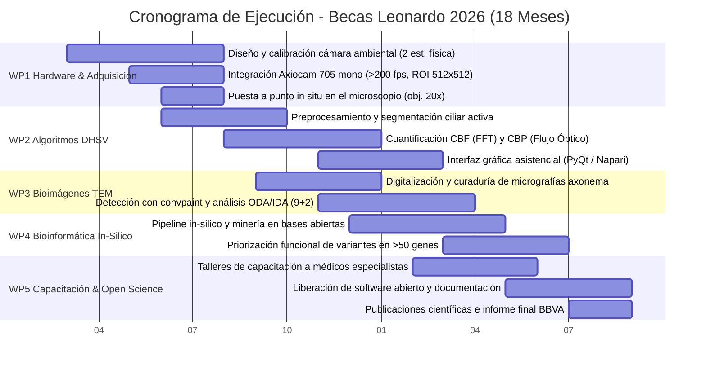

# Memoria Técnica del Proyecto - Becas Leonardo 2026

**Convocatoria:** Becas Leonardo a Investigadores y Creadores Culturales 2026 (Argentina, Colombia y Perú)  
**Fundación BBVA**  
**Área Temática:** Ciencias de la Computación, Ciencia de Datos e Inteligencia Artificial  
**Institución Sede de Ejecución:** Facultad de Ciencias Exactas y Naturales - Universidad de Buenos Aires (FCEN-UBA)  
**Institución en Colaboración Clínica:** Hospital de Niños Dr. Ricardo Gutiérrez (Buenos Aires, Argentina)  

---

# TÍTULO DEL PROYECTO:
## Desarrollo de Plataforma Computacional Integral de Bioimagen, Visión Artificial y Genómica para el Diagnóstico de la Disquinesia Ciliar Primaria

---

## 1. Introducción

La **Disquinesia Ciliar Primaria (DCP)** es un trastorno genético multisistémico caracterizado por la alteración funcional o ultraestructural de las cilias móviles [1, 3]. **Si bien históricamente se la catalogó como infrecuente (con prevalencias estimadas entre 1:15.000 y 1:30.000), estudios genómicos recientes sitúan su prevalencia global en al menos 1:7.500 nacidos vivos** [1, 3]. Presenta una marcada heterogeneidad genética de herencia predominantemente autosómica recesiva, vinculada a mutaciones en más de 60 genes y más de 2.000 variantes patogénicas que afectan proteínas estructurales del axonema [3, 7]. Estas proteínas afectadas pueden encontrarse en el tracto respiratorio superior e inferior, el tracto reproductivo y los ventículos del sistema nervioso central. El déficit en el aclaramiento mucociliar condiciona acumulación crónica de secreciones, infecciones respiratorias recurrentes y daño bronquiectásico progresivo, así como daño en otros sistemas, resultando, entre otros, en problemas de fertilidad [1, 2, 7].

El diagnóstico de la DCP requiere un algoritmo multimodal que combina índices clínicos, óxido nítrico nasal (nNO), videomicroscopía digital de alta velocidad (HSVM/HSVA), microscopía electrónica de transmisión (TEM) y secuenciación genética [2, 3, 7, 8]. **En Argentina, sin embargo, la infraestructura diagnóstica especializada resulta sumamente escasa y el retraso diagnóstico es crítico**: según la reciente cohorte del Laboratorio de Motilidad Ciliar del Hospital de Niños Ricardo Gutiérrez (110 pacientes derivados entre 2022 y 2025), la mediana de edad al diagnóstico de DCP es de 8,8 años (rango intercuartílico [RIC] 2,8–11,9), marcadamente posterior a la media europea de ~5,3 años [3, 8]. Este retraso es particularmente alarmante en pacientes con anatomía visceral normal (*situs solitus*), donde la mediana diagnóstica se posterga hasta los **10,5 años** (RIC 7,8–16), en contraste con los **4,2 años** (RIC 1–11) en niños con defectos de lateralidad o *situs inversus* [8]. Pese a que los síntomas inician en la primera infancia (distrés respiratorio neonatal (73%), rinorrea persistente (81%) y tos húmeda crónica antes de los 6 meses de vida (90%) [8]), **la falta de diagnóstico oportuno propicia tratamientos inadecuados (como asma refractaria en el 52% de los casos) [1, 8], colonización bacteriana precoz, eventual progresión a colonización crónica a partir de los 11–13 años [8] y daño pulmonar estructural permanente** (al momento del diagnóstico el 49% de los pacientes ya presenta bronquiectasias [4, 8]).

El **Hospital de Niños Dr. Ricardo Gutiérrez** es un centro de referencia nacional en patología respiratoria pediátrica compleja y concentra derivaciones de todo el país. Frente a las recomendaciones internacionales de la *European Respiratory Society* (ERS 2017) [5], la *American Thoracic Society* (ATS) y la *PCD Foundation* [2] —que estipulan algoritmos multimodales de alta complejidad—, **el Hospital Gutiérrez implementó y validó la primera estrategia diagnóstica combinada adaptada al contexto asistencial de Argentina** [8]. Dicho protocolo articula cuestionarios clínicos de cribado (ATS-CSQ y PICADAR), medición de nNO y análisis de videomicroscopía de alta velocidad (HSVA) a partir de biopsias de cornete inferior en duplicado, reservando la secuenciación genética y la TEM para casos no concluyentes o según disponibilidad de recursos [8]. Esta estrategia demostró una notable eficiencia diagnóstica: categorizó con certeza o alta probabilidad DCP al 47% de los derivados y, de manera determinante, permitió descartar con seguridad la enfermedad en el 49% de los casos, evitando costosos estudios genéticos en casi la mitad de los pacientes y optimizando sustancialmente los recursos del sistema público de salud [8].

A pesar de estos avances, la batería diagnóstica presenta limitaciones intrínsecas que condicionan su alcance. La determinación de **óxido nítrico nasal (nNO) por quimioluminiscencia requiere maniobras de cooperación activa que solo son técnicamente confiables y reproducibles en niños de 5 años o más (≥5 años) [2, 7, 8], resultando inviable en lactantes y preescolares, precisamente la población donde el diagnóstico temprano previene el daño bronquiectásico irreversible [4, 8]**. **En consecuencia, el diagnóstico en la primera infancia y la confirmación general dependen de las restantes pruebas de la batería, cuyas limitaciones operativas son fácilmente superables mediante visión artificial (*computer vision*), análisis cuantitativo de bioimágenes y ciencia de datos en bioinformática**:
1.  **Videomicroscopía de alta velocidad (HSVM/HSVA)**: La evaluación visual humana del batido ciliar es cualitativa, subjetiva y lenta [5, 8]. La **visión artificial** y el procesamiento temporal de señales (FFT para la frecuencia [CBF] y flujo óptico denso con kimograma para el patrón [CBP]) transforman secuencias de video en métricas objetivas e independientes del operador, detectando discinesias sutiles [5, 8].
2.  **Microscopía electrónica de transmisión (TEM)**: El análisis ultraestructural del axonema 9+2 demanda un escrutinio manual complejo [2, 7]. El **análisis de bioimágenes** con algoritmos híbridos de aprendizaje automático (*convpaint*) permite segmentar de forma automatizada los dobletes microtubulares y cuantificar la ausencia de brazos de dineína (ODA/IDA) con exactitud reproducible [2, 7].
3.  **Genómica clínica**: Frente al alto costo de la secuenciación de paneles comerciales, la **ciencia de datos y bioinformática *in-silico*** permite desarrollar flujos automatizados de bajo costo para priorizar y anotar variantes en >50 genes de DCP a partir de repositorios genómicos abiertos (ClinVar, gnomAD, LatinGen) y modelos estructurales (AlphaFold DB), facilitando la interpretación molecular en el ámbito asistencial [3, 6, 7, 8].

Actualmente, el hospital cuenta únicamente con un microscopio óptico estándar de campo claro antiguo acoplado a una cámara no apta que adquiere a tasas convencionales (≤30 fps), provocando un submuestreo severo (*aliasing*) frente a cilias que baten a 10–15 Hz [5]. **Más crítico aún es la ausencia total de control ambiental**: a temperatura ambiente no controlada (20–22 °C), la frecuencia de batido ciliar se deprime sustancialmente (la CBF es de 6,3–9,0 Hz a 32 °C y de 10–15 Hz a 37 °C) y la muestra se deseca rápidamente en el portaobjetos, induciendo discinesias secundarias y falsos positivos [5, 7]. **Finalmente, la evaluación clínica actual es visual y manual, lo que genera una alta subjetividad y dependencia del operador** [5, 8].

Para superar esta barrera, este proyecto establece una sinergia estratégica orientada a la ingeniería, la computación científica y la capacitación médica:
*   **Sede de Ejecución y Cómputo (FCEN-UBA):** La Facultad de Ciencias Exactas y Naturales de la UBA lidera el desarrollo de los algoritmos de visión artificial, los flujos bioinformáticos *in-silico* de bajo costo, el diseño y fabricación de la cámara ambiental termostatizada y la dirección de estudiantes de grado universitarios.
*   **Colaboración Hospitalaria (Hospital Gutiérrez):** Médicos especialistas de los Servicios de Neumonología y Patología del hospital colaboran en la definición de requisitos clínicos, pruebas del equipamiento óptico en banco de pruebas y reciben la capacitación metodológica para operar la plataforma.

---

## 2. Estado del Arte, Novedad Científica e Hipótesis

### 2.1 Estado del Arte y Limitaciones de los Métodos Actuales
Las directrices de la *European Respiratory Society* (ERS 2017) recomiendan la videomicroscopía de alta velocidad (DHSV) como prueba diagnóstica confirmatoria de primera línea, con una **sensibilidad de 0,95–1,00 y especificidad de 0,93–0,95**, pero estipulan una **fuerte recomendación de NO utilizar el valor de CBF de manera aislada sin el análisis conjunto del patrón de batido (CBP)** [2, 5, 7]. Esto responde a que mutaciones en genes como *DNAH11* generan cilias con frecuencias normales o hipercinéticas pero con un patrón de batido rígido e inefectivo de baja amplitud angular [5, 7].

Sin embargo, el diagnóstico actual a nivel mundial enfrenta tres limitaciones no resueltas [5]:
1.  **Falsos Negativos de TEM y Genética:** La microscopía electrónica de transmisión (TEM) detecta defectos estructurales en el **70–79% de los casos** (ausencia de brazos de dineína externos [ODA], internos [IDA] o desorganización microtubular [MTD]) [2, 7]. Esto implica que **un 20–30% de los pacientes con DCP confirmada presentan ultraestructura en TEM completamente normal o no concluyente**, incluyendo mutaciones en genes como *DNAH11, DRC2, OFD1, GAS2L2, LRRC56, CFAP57, CFAP221, SPEF2* y *RSPH1* [5, 7]. En estos pacientes, la videomicroscopía funcional (DHSV) es el único método capaz de evidenciar la anomalía motil [5].
2.  **Falta de Estandarización Ambiental:** La literatura demuestra que la CBF varía linealmente con la temperatura (la CBF fisiológica de 10–15 Hz solo se alcanza a 37 °C) y que la estabilidad óptima de la muestra de cepillado nasal se preserva durante 3 a 9 horas a temperaturas controladas de transporte [5]. La ausencia de cámaras de incubación termostatizadas en microscopios clínicos compromete la reproducibilidad diagnóstica.
3.  **Subjetividad del Análisis Manual:** La inspección cualitativa del CBP depende enteramente de la experiencia del observador. Métodos computacionales emergentes como el flujo óptico (*optical flow*), el kymograph digital y la microscopía dinámica diferencial (DDM) han demostrado capacidad para parametrizar la asimetría y coordinación ciliar de forma objetiva, pero requieren validación integrada en software clínico amigable [5].

En el aspecto genético, se conocen más de 50 genes asociados a DCP (>2.000 variantes patogénicas) [3, 7]. Mutaciones en *DNAH5* y *DNAI1* codifican componentes de los ODA y representan más del **30% de todos los casos de DCP** [3]. Por su parte, variantes en *CCDC39* y *CCDC40* provocan defectos combinados de IDA y desorganización microtubular (MTD), cursando con fenotipos clínicos muy agresivos de rápida progresión hacia bronquiectasias severas e insuficiencia respiratoria [6, 7]. Si bien la secuenciación comercial resulta prohibitiva para hospitales públicos, las bases de datos abiertas y herramientas bioinformáticas *in-silico* permiten priorizar y clasificar variantes patogénicas a costo prácticamente nulo.

### 2.2 Novedad y Carácter Innovador
Frente a equipamientos comerciales cerrados cuyo costo supera los USD 150.000, esta propuesta ofrece una innovación de **muy alta costo-efectividad** basada en:
1.  **Instrumentación in situ y control ambiental estricto:** Prototipado y fabricación aditiva de una cámara de incubación para platina con control térmico en lazo cerrado a 37 °C ± 0,3 °C y saturación de humedad (>90%), desarrollada con un equipo de dos estudiantes avanzados de grado de Física de la FCEN-UBA mediante impresión 3D, microcontrolador Arduino/ESP32 y sensores de bajo costo (diseño inicial en 4 a 6 meses y seguimiento experimental de 12 meses). Acople de una cámara científica Axiocam 705 mono provista en plaza local vía distribuidor oficial (Bioingeniería) presupuestada en USD 9.000 para cubrir con total seguridad su costo (del orden de USD 8.000) y contingencias de plaza, la cual, operando en una región de interés (ROI) de 512 x 512 píxeles con objetivo de 20x y adaptador 0,5x preexistente, supera los 200 fps con excelente resolución óptica, corrigiendo el sobresampleo innecesario del sistema actual y cumpliendo los estándares internacionales [5].
2.  **Visión por computadora para DHSV:** Algoritmo que calcula la CBF píxel a píxel mediante Transformada Rápida de Fourier (FFT) y clasifica el CBP utilizando flujo óptico denso (Farnebäck) y kymographs automáticos ortogonales a la pared celular, eliminando el sesgo del observador [5].
3.  **Cuantificación digital y aprendizaje automático en micrografías de TEM:** Detección y segmentación robusta de axonemas 9+2 mediante una combinación de aprendizaje automático y deep learning a través de la metodología **convpaint** (extracción de características profundas convolucionales preentrenadas combinadas con clasificadores Random Forest entrenables con pocas anotaciones), respaldada por la duplicación de horas de TEM y financiamiento de preparación de muestras ultraestructurales, seguida de perfilometría radial automatizada y promediado subaxonémico para medir la integridad de los brazos de dineína (ODA/IDA) [2, 7].
4.  **Bioinformática In-Silico de Bajo Costo:** Pipeline computacional reproducible para la anotación y priorización clínica de variantes patogénicas en >50 genes, minando bases públicas abiertas sin generar costos de secuenciación masiva *de novo* [3, 6, 7].
5.  **Transferencia y Capacitación Médica en Open Science:** Capacitación directa a los especialistas del hospital y liberación íntegra del software bajo código abierto, allanando el camino para futuras fases diagnósticas.

### 2.3 Hipótesis de Trabajo
La integración de instrumentación óptica in situ de bajo costo (cámara ambiental a 37 °C y sensor de alta velocidad) con una suite de visión computacional, análisis bioinformático *in-silico* y capacitación médica interdisciplinaria permitirá dotar al Hospital Gutiérrez de las capacidades técnicas y formativas necesarias para el diagnóstico cuantitativo de la DCP según estándares internacionales, eliminando la subjetividad del operador y sin depender de equipamientos comerciales privativos.

---

## 3. Objetivos

### Objetivo General
Desarrollar, implementar y transferir una plataforma computacional integral de bioimagen, visión artificial y genómica de bajo costo para el diagnóstico de la Disquinesia Ciliar Primaria, ejecutada en la Facultad de Ciencias Exactas y Naturales (UBA) en colaboración con médicos del Hospital de Niños Dr. Ricardo Gutiérrez.

### Objetivos Específicos
1.  **OE1:** Diseñar y construir una cámara ambiental termostatizada a 37 °C y humedad relativa saturada (>90%) mediante impresión 3D y control electrónico de bajo costo (Arduino/ESP32) con estudiantes de grado, integrando una cámara Axiocam 705 mono acoplada con objetivo 20x y adaptador 0,5x (resolución ROI de 512 x 512 píxeles a >200 fps, corrigiendo el actual sobresampleo óptico) operada mediante software de código abierto (*Micro-Manager*).
2.  **OE2:** Desarrollar un pipeline computacional de visión artificial en Python para la segmentación del epitelio ciliado, cálculo espectral de CBF píxel a píxel por FFT y cuantificación de descriptores cinéticos de CBP mediante flujo óptico y kymographs.
3.  **OE3:** Desarrollar un algoritmo de análisis digital de bioimágenes de Microscopía Electrónica de Transmisión (TEM) basado en la combinación de aprendizaje automático y deep learning (**convpaint**) para la detección y segmentación de axonemas, cuantificando la geometría 9+2 y la presencia de brazos de dineína externos e internos (ODA/IDA).
4.  **OE4:** Implementar un flujo bioinformático *in-silico* de bajo costo para la priorización y anotación funcional de variantes en genes causales de DCP (>50 genes) a partir de repositorios genómicos públicos abiertos, correlacionando los perfiles moleculares con los fenotipos cinéticos (DHSV) y ultraestructurales (TEM).
5.  **OE5:** Capacitar a los médicos especialistas del Hospital Gutiérrez y liberar el software como herramienta de código abierto (*Open Science*).

---

## 4. Metodología y Plan de Trabajo (Work Packages)

El proyecto se estructura en **5 Paquetes de Trabajo (WPs)** a lo largo de **18 meses**:

---

### WP1: Modernización Instrumental in-situ y Control Ambiental (Meses 1-6)
*   **Metodología:**
    1.  *Cámara de incubación ambiental (diseño, validación e implementación):* El modelado, construcción, calibración y validación experimental de la cámara ambiental termostatizada para la platina del microscopio se llevará a cabo con un equipo de dos estudiantes avanzados de grado de la Licenciatura en Ciencias Físicas de la FCEN-UBA con dedicación anual de 12 meses (estipendio de $350 USD/mes cada uno). Los estudiantes de grado se encargarán específicamente de diseñar, validar e implementar el sistema de control de temperatura y humedad. La estructura hermética se fabricará principalmente mediante impresión 3D (filamento termoplástico PETG). Se desarrollará un lazo de control térmico PID de alta precisión comandado por un microcontrolador de bajo costo (Arduino o ESP32) acoplado a sensores de temperatura digitales de bajo costo, asegurando una temperatura de muestra homogénea de **37 °C ± 0,3 °C** para suprimir el sesgo térmico sobre la CBF (que decae a 6,3–9,0 Hz a temperaturas subfisiológicas de ≤32 °C) [5, 7]. Se incluirá un reservorio para saturación de humedad (>90%), previniendo la evaporación del menisco durante la ventana de viabilidad ciliar de 3 a 9 horas [5].
    2.  *Sensor de alta velocidad y optimización del muestreo óptico:* Se incorporará una cámara científica **Axiocam 705 mono**, provista localmente a través de su distribuidor oficial en Argentina (Bioingeniería), con un costo de plaza del orden de 8.000 USD y presupuestada con total holgura en 9.000 USD para absorber contingencias arancelarias o de cotización y asegurar la concreción del gasto sin riesgos aduaneros. Conforme a las recomendaciones internacionales que exigen capturar a 120–500 fps [5], la Axiocam 705 mono superará holgadamente los **200 fps** configurando una región de interés (ROI) de **512 x 512 píxeles**. El sistema óptico se optimizará empleando el adaptador C-mount de reducción de 0,5x ya disponible en el microscopio y seleccionando un objetivo de **20x** de alta apertura numérica, resolviendo de forma directa el sobresampleo óptico que aqueja a la configuración actual (donde se utilizan aumentos excesivos que reducen el campo de observación y la luminosidad sin aportar ganancia de resolución útil) y asegurando una excelente calidad diagnóstica.
    3.  *Software de control y estación de adquisición in situ:* Configuración de la secuencia de captura en **Micro-Manager** y scripts en Python para streaming directo a memoria RAM y almacenamiento sin pérdida de fotogramas, operando sobre la computadora provista para el hospital (laptop o de escritorio, USD 2.000) con 32–64 GB RAM y disco NVMe ultrarrápido.
*   **Entregables:** Cámara ambiental termostatizada a 37 °C fabricada en impresión 3D con control Arduino/ESP32; estación de videomicroscopía adaptada con cámara Axiocam 705 mono adquiriendo a >200 fps (ROI de 512x512 px, objetivo 20x) y computadora de adquisición in situ.

---

### WP2: Pipeline Computacional de Visión Artificial para DHSV (Meses 4-12)
*   **Metodología:**
    Con la dedicación anual de un estudiante de finalización de carrera de la FCEN-UBA (12 meses, estipendio de $350 USD/mes) enfocado en el análisis de bioimágenes de videomicroscopía y microscopía electrónica, operando sobre la estación de trabajo GPU de alto rendimiento (USD 3.000) instalada en la facultad:
    1.  *Preprocesamiento:* Corrección de desplazamiento de tejido mediante correlación de fase y realce de bordes.
    2.  *Segmentación automatizada:* Detección de regiones epiteliales activas mediante varianza temporal píxel a píxel, discriminando moco estático, eritrocitos y detritos celulares.
    3.  *Cuantificación de CBF (Frecuencia):* Análisis espectral de potencia mediante **Transformada Rápida de Fourier (FFT)** aplicada a la serie temporal de intensidad píxel a píxel. Generación de mapas de calor de frecuencia dominante (rango fisiológico: 10–15 Hz a 37 °C), CBF media y áreas inmóviles (<4 Hz) [5, 7].
    4.  *Cuantificación de CBP (Patrón de Batido):* Conforme al mandato ERS de no evaluar CBF aisladamente [2, 5], se calculará el campo vectorial de velocidad mediante **flujo óptico denso (Farnebäck)** y se generarán kymographs digitales automáticos perpendiculares a la membrana para medir: amplitud angular de batido, asimetría de carrera efectiva vs. recuperación (*effective/recovery stroke*), e índice de disquinesia ciliar (CDI) para clasificar movimientos normales, rígidos (*DNAH11*), rotacionales (*HYDIN, RSPH*) o inmovilidad completa (*DNAH5, DNAI1*) [5, 7].
*   **Entregables:** Módulo de visión por computadora en Python con interfaz gráfica (GUI en PyQt/Napari) para uso médico.

---

### WP3: Procesamiento Cuantitativo de Bioimágenes en TEM (Meses 6-14)
*   **Metodología:**
    1.  *Curaduría y digitalización:* Digitalización y calibración espacial de micrografías electrónicas de archivo de cortes transversales de axonemas ciliares respiratorios del Servicio de Patología del Hospital Gutiérrez y repositorios públicos.
    2.  *Detección y segmentación axonémica con aprendizaje automático y deep learning (convpaint):* La detección y segmentación a nivel de píxel de los axonemas se realizará implementando **convpaint**, una metodología híbrida que combina el aprendizaje automático clásico con representaciones profundas (*deep learning*), a cargo del estudiante de finalización de carrera. Mediante la extracción de mapas de características multiescala generados por capas intermedias de redes neuronales convolucionales preentrenadas (backbone convolucional profundo), se entrena interactivamente un clasificador supervisado liviano (*Random Forest*). Esta técnica supera las dificultades de la escasa disponibilidad de muestras anotadas en TEM y la variabilidad de contraste, permitiendo segmentar de forma precisa el anillo periférico de los 9 dobletes microtubulares y el par central frente al fondo celular y detritos [2, 7].
    3.  *Cuantificación de brazos de dineína (ODA/IDA) y Servicio Integral de Microscopía Electrónica:* Sobre los axonemas segmentados por convpaint, se aplicará perfilometría radial de intensidad óptica normalizada en las posiciones angulares del microtúbulo A para cuantificar la densidad de brazos de dineína externos (ODA) e internos (IDA). Se integrará alineamiento y promediado subaxonémico 2D (*sub-axonemal averaging*) para maximizar la relación señal-ruido, reportando la proporción de defectos ultraestructurales según guías internacionales [2, 7]. Para la obtención de imágenes calibradas, se contrata el servicio integral del centro de microscopía electrónica (presupuestado en un único ítem de $2.500 USD) que incluye tanto la preparación de muestras biológicas (fijación con glutaraldehído y OsO4, inclusión en resina epoxi, ultramicrotomía de 70–90 nm y tinción de contraste) como las horas de uso de microscopio TEM.
*   **Entregables:** Algoritmo híbrido de segmentación (convpaint) y reporte cuantitativo automatizado de integridad axonémica y brazos de dineína en TEM.

---

### WP4: Bioinformática In-Silico de Bajo Costo y Caracterización de Variantes Genéticas (Meses 8-16)
*   **Metodología:**
    Con el fin de garantizar una **estrategia de bajo costo que prescinda de costosos reactivos o servicios de secuenciación masiva *de novo***, este paquete de trabajo se desarrollará íntegramente mediante flujos computacionales *in-silico*, minería de repositorios genómicos de acceso abierto y herramientas de software libre, articulando con **pasantes de la carrera de Ciencia de Datos de la FCEN-UBA** que realizarán proyectos de análisis cortos y específicos integrados en su plan formativo:
    1.  *Minería en repositorios genómicos abiertos:* Recopilación y curaduría sistemática de variantes patogénicas y de significado incierto (VUS) en el catálogo de **más de 50 genes asociados a DCP** [3, 7] desde bases de datos públicas internacionales y regionales (ClinVar, gnomAD v4, 1000 Genomes, Ensembl y LatinGen / ABraOM para poblaciones latinoamericanas).
    2.  *Pipeline automatizado de anotación y priorización liviana:* Implementación de un flujo en Python / Bash que ejecuta la anotación funcional mediante Variant Effect Predictor (VEP) de Ensembl y SnpEff, combinando herramientas de predicción de patogenicidad *in-silico* de acceso libre (CADD, REVEL, AlphaMissense). El pipeline prioriza variantes en genes ODA mayores (*DNAH5, DNAI1*, responsables de >30% de casos) [3], genes con ultraestructura normal en TEM (*DNAH11*) [5, 7] y genes asociados a fenotipos agresivos con desorganización microtubular (*CCDC39, CCDC40*) [6, 7].
    3.  *Análisis de variantes de parada prematura (PTC) y modelado estructural:* Identificación de variantes *nonsense* y frameshift que generan codones de terminación prematura (PTC, presentes en hasta un 28% de pacientes) [6], evaluando el impacto conformacional en los complejos axonémicos mediante bases de estructuras predichas (AlphaFold DB / Foldseek).
    4.  *Generador de reportes clínicos moleculares de código abierto:* Desarrollo de un módulo computacional liviano que permita a los profesionales ingresar archivos de variantes estándar (VCF) y obtener un reporte automatizado estandarizado bajo criterios ACMG/AMP sin costos de licenciamiento privativo.
*   **Entregables:** Pipeline bioinformático *in-silico* de bajo costo publicado; catálogo estructurado y anotado de variantes en >50 genes de DCP; módulo de generación automatizada de reportes clínicos moleculares.

---

### WP5: Capacitación a Médicos Especialistas del Hospital Gutiérrez y Liberación en Acceso Abierto (Meses 12-18)
*   **Metodología:**
    Este paquete de trabajo orienta sus actividades a la transferencia tecnológica, la capacitación profesional interdisciplinaria y la consolidación de la ciencia abierta (*Open Science*):
    1.  *Talleres de capacitación médica especializada:* Dictado de jornadas teórico-prácticas y talleres de entrenamiento dirigidos a médicos neumonólogos, patólogos y bioquímicos del Hospital de Niños Dr. Ricardo Gutiérrez. Los módulos comprenderán la operación de la cámara ambiental termostatizada a 37 °C, la adquisición sincrónica de videomicroscopía a alta velocidad (>200 fps) en el microscopio óptico y la correcta interpretación de los reportes automatizados de CBF, CBP y métricas axonémicas de TEM [1, 2, 5].
    2.  *Protocolos operativos estándar (SOP) y guías asistenciales:* Elaboración y transferencia de manuales ilustrados de buenas prácticas basados en las recomendaciones de consenso internacional (ERS / PCD Foundation) para la toma adecuada de cepillado nasal y su mantenimiento térmico ex vivo [1, 2, 5].
    3.  *Liberación del software en código abierto (Open Science):* Publicación de la suite computacional completa en GitHub bajo licencia libre (GPL/MIT), con imágenes de contenedor Docker y entornos Conda documentados para garantizar la instalación y reproducibilidad sin barreras económicas en cualquier institución pública de salud de la región.
    4.  *Difusión científica y memoria institucional:* Redacción y envío de dos artículos científicos sobre la metodología computacional e instrumentación abierta a revistas internacionales indexadas de acceso abierto (Q1/Q2); presentación de resultados en congresos de microscopía y neumonología; elaboración de la memoria final para la Fundación BBVA.
*   **Entregables:** Personal médico y técnico del Hospital Gutiérrez formalmente capacitado; manuales de procedimiento y guías de buenas prácticas transferidos; suite de software libre publicada en GitHub; 2 manuscritos científicos internacionales enviados; informe final de la Beca Leonardo.

---

## 5. Cronograma de Hitos y Entregables (18 Meses)

| Mes | Hito Clave / Entregable | Paquete | Respaldo en Literatura |
| :---: | :--- | :---: | :--- |
| **M03** | Prototipo de cámara ambiental termostatizada (37 °C) en impresión 3D y Arduino/ESP32 calibrado por estudiantes de física. | WP1 | Requisito de temperatura fisiológica [5, 7] |
| **M06** | Cámara Axiocam 705 mono (>200 fps, ROI 512x512, obj. 20x) adaptada al microscopio del Hospital Gutiérrez con Micro-Manager. | WP1 | Estándar ERS de muestreo a 120–500 fps [5] |
| **M09** | Pipeline de visión por computadora para cálculo de CBF (FFT) y CBP (flujo óptico) operativo en videos piloto. | WP2 | Análisis conjunto mandatario CBF+CBP [2, 5] |
| **M11** | Interfaz gráfica interactiva (GUI en PyQt/Napari) validada para uso por el personal médico asistencial. | WP2 | Eliminación de subjetividad y sesgo del operador [5] |
| **M13** | Módulo de segmentación axonémica en TEM mediante convpaint y cuantificación de brazos de dineína (ODA/IDA) calibrado. | WP3 | Detección objetiva de ODA/IDA en TEM [2, 7] |
| **M15** | Pipeline bioinformático *in-silico* de bajo costo ejecutado y catálogo de variantes en >50 genes completado. | WP4 | Minería en bases genómicas abiertas [3, 6, 7] |
| **M17** | Talleres de capacitación a médicos especialistas del Hospital Gutiérrez y transferencia de manuales completados. | WP5 | Estándares de formación y buenas prácticas [1, 4] |
| **M18** | Liberación de código abierto en GitHub, remisión de artículos científicos y reporte final a Fundación BBVA. | WP5 | Ciencia abierta y difusión preceptiva BBVA [1, 5] |

---

## 6. Factibilidad, Gestión de Riesgos y Plan de Mitigación

*   **Factibilidad Institucional y Capacidad Preexistente (Ítems de Costo Nulo):** La viabilidad técnica y operativa de la propuesta está plenamente garantizada gracias al ecosistema de investigación de la FCEN-UBA y a la articulación con el Hospital Gutiérrez. El presupuesto solicitado se optimiza significativamente debido a que una porción crítica de los requerimientos ya se encuentra disponible sin generar costos para el proyecto:
    1.  *Adaptador C-mount:* El microscopio óptico del hospital ya dispone del lente de reducción 0,5x necesario para acoplar la Axiocam 705 mono.
    2.  *Infraestructura de cómputo y servidores preexistente:* La FCEN-UBA cuenta con clústeres de cálculo de alto rendimiento y servidores dedicados para almacenamiento masivo, resguardo de repositorios y procesamiento bioinformático, complementando a costo cero el equipamiento informático específico presupuestado (la computadora de USD 2.000 —laptop o de escritorio— para adquisición in situ en el hospital y la estación de trabajo GPU de USD 3.000 para el desarrollo de los estudiantes en la FCEN-UBA).
    3.  *Taller mecánico de precisión propio:* El maquinado y ajuste de la platina térmica de aluminio será efectuado íntegramente por el Taller Mecánico de la FCEN-UBA, sin erogaciones de tercerización técnica.
    4.  *Reactivos e insumos de calibración:* Los reactivos químicos, patrones micrométricos de calibración espacial y soluciones buffer son aportados por los laboratorios de FCEN-UBA y del hospital.
    5.  *Pasantes de ciencia de datos:* La facultad dispone de estudiantes de la Licenciatura en Ciencia de Datos que colaboran en proyectos académicos cortos y específicos de minería genómica sin demandar líneas presupuestarias directas.
    6.  *Software de código abierto:* Toda la plataforma se apoya en librerías y entornos libres (Python, Micro-Manager, Napari, VEP, AlphaFold DB), eliminando licencias comerciales.
    7.  *Marco ético simplificado:* Al no realizarse ensayos clínicos invasivos en pacientes pediátricos en esta fase, el proyecto prescinde de aprobaciones éticas complejas, focalizándose en desarrollo instrumental, bioimágenes in vitro/retrospectivas y capacitación médica [1, 4].
*   **Masa Crítica Multidisciplinaria y Capacidad de Liderazgo del Postulante:** La FCEN-UBA reúne a una comunidad científica de excelencia con expertos, investigadores y estudiantes dedicados a las disciplinas troncales del proyecto: **biología, física, computación y ciencia de datos**. Este entorno brinda un respaldo formativo y conceptual permanente. Asimismo, dada la sólida trayectoria del investigador postulante y su **experiencia comprobada coordinando y dirigiendo proyectos multidisciplinarios** (articulando instrumentación física, desarrollo de algoritmos de visión por computadora, bioanálisis de imágenes y diálogo clínico con el sector médico), el proyecto cuenta con el liderazgo idóneo para ejecutarse con total solvencia técnica y rigor metodológico.
*   **Matriz de Riesgos y Mitigaciones:**
    1.  *Riesgo: Demoras aduaneras o de provisión en la adquisición de equipamiento.*  
        *Mitigación:* La cámara científica Axiocam 705 mono se adquiere en plaza local a través del distribuidor oficial en Argentina (Bioingeniería), eliminando trámites aduaneros complejos y demoras de importación. Asimismo, los componentes de la cámara ambiental corresponden a manufactura aditiva y electrónica comercial accesible localmente (Arduino/ESP32). Se dispone preventivamente de cámaras en laboratorios de FCEN-UBA para avanzar en el desarrollo de visión artificial.
    2.  *Riesgo: Heterogeneidad en formatos de video y bioimágenes de archivo.*  
        *Mitigación:* El algoritmo de preprocesamiento (WP2) incorpora conversores de formato universales (TIFF, AVI, HDF5) y normalizadores de histograma temporal para procesar datos independientemente del dispositivo de captura.
    3.  *Riesgo: Dificultad para clasificar variantes genéticas de significado incierto (VUS).*  
        *Mitigación:* El pipeline bioinformático *in-silico* (WP4) integra múltiples predictores ortogonales de patogenicidad y modelos estructurales basados en AlphaFold DB para brindar una clasificación multifactorial robusta según guías ACMG/AMP.

---

## 7. Impacto Esperado, Beneficio Social y Transferencia Sanitaria

1.  **Impacto en la Salud Infantil y Transferencia Asistencial:** La capacitación brindada a los médicos especialistas del Hospital Gutiérrez y la provisión de una estación de videomicroscopía termostatizada y calibrada deja instalada en el hospital la capacidad técnica para que, una vez tramitadas las autorizaciones correspondientes en etapas posteriores, los profesionales dispongan de herramientas objetivas para un diagnóstico precoz, permitiendo instaurar oportunamente kinesioterapia respiratoria y tratamiento antibiótico que reviertan las dilataciones cilíndricas iniciales y prevengan el daño pulmonar permanente (bronquiectasias irreversibles) [1, 2, 4, 6].
2.  **Soberanía Tecnológica en Salud Pública:** Se demuestra que la conjunción entre la universidad pública (FCEN-UBA) y el hospital pediátrico permite modernizar instrumental preexistente a una fracción del costo de equipos comerciales cerrados importados, creando capacidad diagnóstica local sustentable.
3.  **Aporte a la Genómica Médica de Código Abierto:** Generación de un flujo bioinformático reproducible y de libre uso para la anotación y priorización de variantes de DCP en bases públicas, enriqueciendo los recursos bioinformáticos disponibles para la región [3, 7].
4.  **Ciencia Abierta y Formación de Recursos Humanos:** Formación integral de tres estudiantes en FCEN-UBA (dos estudiantes avanzados de grado de Física para hardware ambiental y un estudiante de finalización de carrera para análisis de bioimágenes de videomicroscopía y TEM por 12 meses c/u), complementada con la formación de pasantes de ciencia de datos, capacitación médica continua y liberación del software en acceso abierto para cualquier hospital público de América Latina.
5.  **Reconocimiento Institucional Preceptivo:** Todos los resultados, publicaciones científicas y presentaciones mencionarán de forma explícita: *«Proyecto realizado con la Beca Leonardo de la Fundación BBVA 2026. Argentina»*.

---

## 8. Referencias Bibliográficas (Fuentes del Proyecto)

1.  **Robson, E. A., Spoletini, G., Bercusson, A., Carr, S. B., Carroll, M., Dexter, K., Dixon, L., Hogg, C., Jones, A., Kenia, P., Loebinger, M., Lucas, J. S., Moya, E., O’Callaghan, C., Patel, D., Peckham, D. G., Range, S., & Walker, W. T. (2026).** Primary ciliary dyskinesia: a national expert consensus statement on standards of care. *ERJ Open Research*, DOI: 10.1183/23120541.00892-2025.
2.  **Shapiro, A. J., Zariwala, M. A., Ferkol, T., Davis, S. D., Sagel, S. D., Dell, S. D., Rosenfeld, M., Olivier, K. N., Milla, C., Daniel, S. J., Kimple, A. J., Manion, M., Knowles, M. R., & Leigh, M. W. (2016).** Diagnosis, monitoring, and treatment of primary ciliary dyskinesia: PCD foundation consensus recommendations based on state of the art review. *Pediatric Pulmonology*, 51(2), 115–132. DOI: 10.1002/ppul.23304.
3.  **Collison, R., Hyatali, S. A., Kamenova, A., Rashed, A., Riley, D., Kumar, K., Stowell, J. M., & Loebinger, M. R. (2025).** Primary ciliary dyskinesia: aetiology, diagnosis and clinical management. *Clinical Medicine*, 25(1), 100288. DOI: 10.1016/j.clinme.2024.100288.
4.  **Comité Nacional de Neumonología, Sociedad Argentina de Pediatría (Smith, S., Salim, M., Bujedo, E., Martinchuk Migliazza, G., Tognini, C., Nociti, Y., Garetto, S., Olguín Ciancio, M., Pinto, F., et al.) (2020).** Bronquiectasias no relacionadas con fibrosis quística en niños: guías de diagnóstico, seguimiento y tratamiento. *Archivos Argentinos de Pediatría*, 118(Supl 1), S1–S24. DOI: 10.5546/aap.2020.S1.
5.  **Bricmont, N., Alexandru, M., Louis, B., Papon, J.-F., & Kempeneers, C. (2021).** Ciliary videomicroscopy: a long beat from the European Respiratory Society guidelines to the recognition as a confirmatory test for primary ciliary dyskinesia. *Diagnostics*, 11(4), 666. DOI: 10.3390/diagnostics11040666.
6.  **Paff, T., Omran, H., Nielsen, K. G., & Haarman, E. G. (2021).** Current and future treatments in primary ciliary dyskinesia. *International Journal of Molecular Sciences*, 22(18), 9834. DOI: 10.3390/ijms22189834.
7.  **Wrona, J., Krupa, Z., Zawadzka, M., Rydzek, J., Dorobisz, K., & Bania, J. (2025).** Primary ciliary dyskinesia—current diagnostic and therapeutic approach. *Journal of Clinical Medicine*, 14(3), 856. DOI: 10.3390/jcm14030856.
8.  **Balinotti, J. E., Medin, M., Lacera Rincón, Á., Frías, G., Esnaola Azcoiti, M., Ropelato, G., Khoury, M., & Teper, A. (2026).** Discinesia ciliar primaria: caracterización clínica y tomográfica utilizando una estrategia diagnóstica combinada. *Archivos Argentinos de Pediatría*, 124(1), e202510825. DOI: 10.5546/aap.2025-10825.
